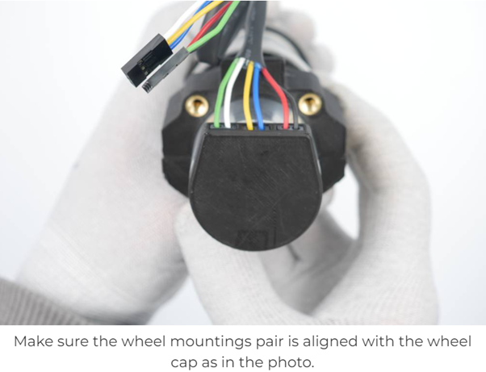
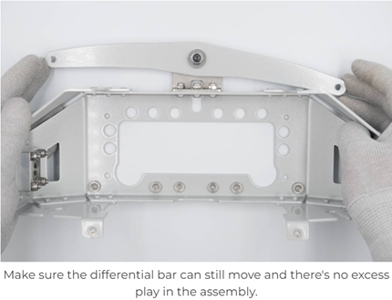
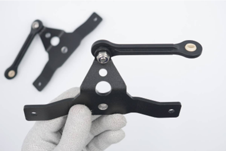
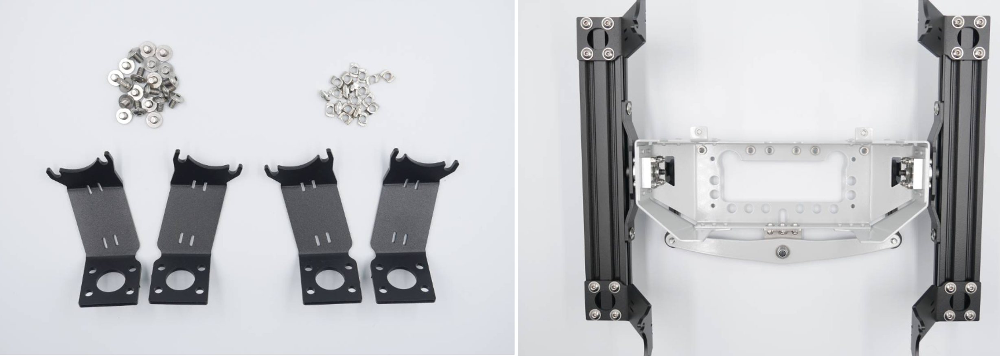
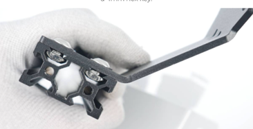
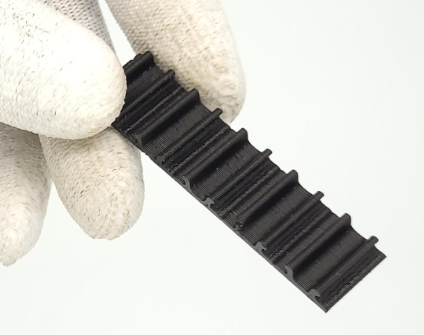

<h1 align="center"> LeoRover Assembly </h1>

This section is dedicated to the assembly stage of the Leo-Rover robot. Detailed official documentation for the construction of the Leo-Rover is available and should be followed throughout the assembly process, as outlined in the official assembly guide found at https://www.leorover.tech/assembly/tools. However, it is imperative to underscore certain critical aspects and considerations relevant to the assembly procedure. As such, this section aims to highlight key steps and noteworthy insights that need special attention. It is imperative that you review both the comprehensive documentation available on the official Leo-Rover website and the supplementary information provided herein.

**Please follow the instructions until Task 7, then use documentation that we provide in the next stage for the remaining parts.**

---

<h2 align="center">Task 1: Wheel Assembly</h2>

You should assemble four wheels. You can follow the instructions provided at https://www.leorover.tech/assembly/wheel-assembly. The estimated time required for assembling each wheel is approximately 20 minutes. The first step of the instructions has already been completed, so you do not need to perform 'Step 1: Motor assembly.' For the remaining parts, please follow the instructions. You can work on each wheel separately as there is no dependency during the assembly process.

Pay attention to the following when you assemble:

### Wheel Mounts

Make sure the wheel mountings pair is aligned with the wheel cap.

    

---

<h2 align="center">Task 2: Main Electronics Box (MEB)</h2>

Please follow the instructions available at the following link: https://www.leorover.tech/assembly/main-electronics-box-meb

**Important Notes:**

- Avoid applying excessive force to cables or pins, as they can easily break.
- As you assemble, note that the inside of the box will become tight. Consequently, you may need to bend some cables. Exercise caution when connecting cables to the Raspberry Pi and controller board.
- Pay close attention to the direction of the sockets; they should match the orientation shown in the images. The white dot on the sockets serves as a guide to identify the correct direction.
- Strive to keep the inside of the box as organized as possible. Please closely replicate the process outlined on the website, including cable organization and zip-tie connections.

---

<h2 align="center">Task 3: Frame and Suspension</h2>

### Differential Bar

It should be loose enough to allow movement but tight enough to prevent free motion.

    

### Main Axis Assembly

When assembling plastic pushrods, be sure to handle them with care. They should be tightened enough to eliminate any play but still allow the pushrod to move. After you move it, it should remain in position as demonstrated in the following image.

    

### Wheel Holders

There are four wheel holders for the four wheels, but they are not the same. The wheel holders on the front and rear sides have different tilt directions. The assembly should resemble the configuration shown in the following image.

    

Every T-nut should be rotated in a manner that allows it to securely catch the groove of the beam from the inside. This is crucial because otherwise, they may appear to fit tightly but won't effectively hold the assembly. Please refer to the following image to see how it should be positioned.

    

---

<h2 align="center">Task 4: Battery</h2>

### Battery Button

When you unpack the battery box, you may encounter two possible types of battery buttons. The instructions for cable connections for both types of buttons are provided in the instructions. Be sure to identify the instructions that match your specific type of button, and ensure that you connect the cables into the correct pins as specified.

---

<h2 align="center">Task 5: Wheels to MEB Assembly</h2>

### Wheel Cable Routing

The routing of the wheel cables is of great importance. Please take careful note of the images provided in the instructions and follow the exact route depicted.

### Securing the Cables

Plastic cable clips are not available for use in this step. You can substitute them with zip-ties instead.

    

### Connecting the Wheels

The wheels must be connected to the correct pins on the controller board, so please pay special attention to this connection. The images in the instructions illustrate the correct connection order. Do not alter the order of the cables, as this can result in incorrect movement of the robot in the future.

---