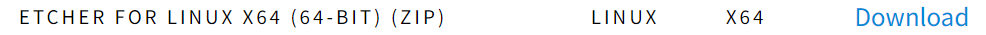
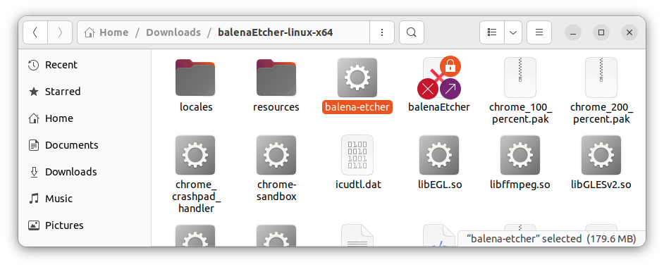
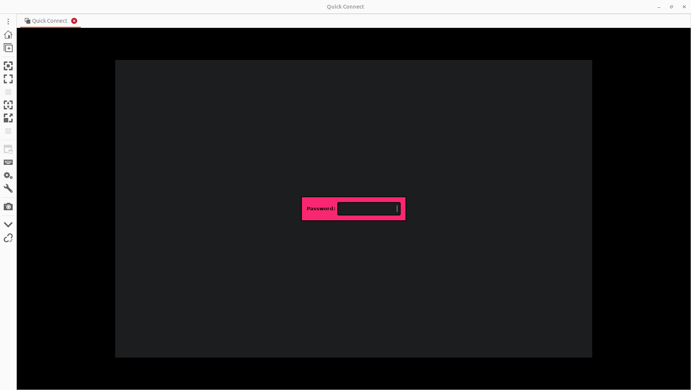
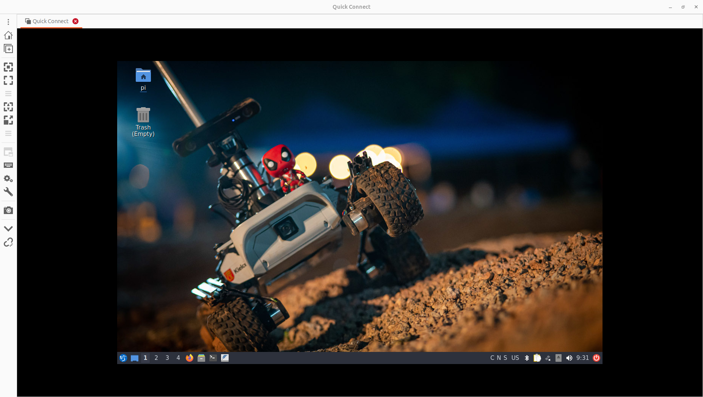

<h1 align="center"> Installing LeoOS and Establishing Remote Connection</h1>

This section focuses on installing the LeoOS operating system on the Raspberry Pi and connecting to the Raspberry Pi using two different methods. Once you have successfully completed the steps in this section, you will be able to access and modify the folders and settings inside the Raspberry Pi.

---
<h2 align="center">Step 1: Installing Required Softwares</h2>

**LeoOS** : This is the official operating system for Raspberry Pi, which includes ROS2 Jazzy pre-installed. You will need to burn this image onto your Raspberry Pi. You can download the LeoOS image from

https://github.com/LeoRover/LeoOS/releases

Install the latest **full** version of the LeoOS.

**Balena Ethcer** : You will use it to burn the LeoOS image onto the SD card.

Download Etcher from https://etcher.balena.io

and install it on your computer.

**For Linux**
Please select the following option to dowload

<p align="center">
    
</p>

To run the application, either double click the **balena-etcher** icon (see the image below),

<p align="center">
    
</p>

or run it from the terminal using
```
./balena-etcher
```

**PuTTY** :You will use it to connect to the Raspberry Pi using your computer (SSH connection).

Download PuTTY from https://www.PuTTY.org
and install it on your computer.
You do not need to install PuTTY if have a linux installed computer.


---
<h2 align="center">Step 2: Burning LeoOS Image into an SD Card Using Etcher</h2>

Connect the SD Card to your computer. Open Etcher, and select the LeoOS you downloaded in Step 1.

<p align="center">
    
</p>

Select your USB device

<p align="center">
    
</p>

Finally, click 'Flash.' It will take around 5 minutes to finish the flashing process.


---
<h2 align="center">Step 3: Turning On LeoRover</h2>
Mount the SD Card into the Raspberry Pi using the plastic tool provided in the package.

<p align="center">
    
</p>

Turn on LeoRover by pressing the button shown in the following figure
<p align="center">
    
</p>

The green LED of the power button will start blinking, and after some time (15-20 seconds), you will be able to see the Wi-Fi network of the LeoRover.

**Important Note** : To avoid confusion when setting up multiple robots, please follow these steps:

<ol>
<li>Do not turn on your robot at the same time to prevent difficulty in determining which Wi-Fi network belongs to your robot.</li>
<li>One group should turn on their robot.</li>
<li>Connect to the robot using the Wi-Fi network specific to their robot.</li>
<li>Change the network ID to "LeoRover-GROUPX," where X represents your group number.</li>
<li>Following groups should then follow the same procedure for their robots.</li>
</ol>
    
Please note that these steps are only necessary during the initial setup of your robots. Once the network IDs are customized to include group numbers, you can run all the robots simultaneously without confusion, as each will have a distinctive name.


---
<h2 align="center">Step 4: Connecting LeoRover</h2>
### Windows ###
You should see a LeoRover network specific to your robot, similar to the image below.

<p align="center">
    
</p>

The password for all networks (for all robots) is 'password' by default. Enter the password and connect to your robot.

After establishing the connection, run PuTTY, which you downloaded in Step 1. Type your robot's IP address (10.0.0.1) in the 'Host Name (or IP Address)' field and leave the other settings unchanged. Your PuTTY window should resemble the following image.
<p align="center">
    
</p>

Click **Open** . The following warning will be raised, click **Accept**.

<p align="center">
    
</p>

Now, you should see a login screen like the image below. The login information should be as follows:

**login as:** pi

**password:** raspberry

<p align="center">
    
</p>

You should log in after entering the provided ID and password. Please note that the password will not be visible as you type.

### Linux ###

You have SSH client already installed on ubuntu. Open a new terminal in your computer and type:

```
ssh pi@10.0.0.1
```
Then, type **yes** and **raspberry**.


---
<h2 align="center">Step 5: Changing Wifi ID</h2>
Before proceeding, you need to change the name of your robot's Wi-Fi network ID, as explained in Step 3. To do this, open the network settings by pasting the following code into the PuTTY console:
```
sudo nano /etc/hostapd/hostapd.conf
```
Change the Wi-Fi name (SSID) according to your group number. For example, the first group should name their network as 'LeoRover-GROUP1'.

<p align="center">
    
</p>

Please only change the name of the network; do not modify the password or other parameters. After renaming it correctly, press **Ctrl+o**, **Enter**, **Ctrl+x**.

Now, your new configuration is saved. Finally, restart your network using the following code:

```
sudo systemctl restart hostapd
```
It will disconnect you from the LeoRover Wi-Fi, and the Wi-Fi name will be updated as follows:

<p align="center">
    
</p>


---
<h2 align="center">Step 6: Connecting via Remote Desktop Connection</h2>
### Windows ###

With an SSH connection (PuTTY), you have access to a console that allows you to modify your robot's software. Another way to connect to the Raspberry Pi is to use Remote Desktop Connection, which enables you to directly view the desktop of the Raspberry Pi instead of a console. To use Remote Desktop Connection, follow these steps:

<p align="center">
    
</p>

Type your LeoRover's IP address and click 'Connect'.

<p align="center">
    
</p>

Select **Yes** for following alert

<p align="center">
    
</p>

Enter the password and id 

**username:** pi

**password:** raspberry

<p align="center">
    
</p>

Now, you should see the desktop of the LeoRover as shown below:

<p align="center">
    
</p>

You will notice that ROS Jazzy is already installed on the robot.

<p align="center">
    
</p>

Now, you can navigate through the folders to explore what is installed within the LeoRover operating system.

### Linux ###

Run the remmina application

<p align="center">
    
</p>

Add a new remote using button on left top corner

<p align="center">
    
</p>

Type the raspberry pi ip, id and password and then click connect.

<p align="center">
    
</p>

Once you connect it should ask for a password:
<p align="center">
    
</p>

Now, you should be able to see the screen:
<p align="center">
    
</p>


---
<h2 align="center">Step 7: Update Robot Firmware</h2>

<h3>Configure your device as an internet gateway</h3>

To update and install operating system packages, the system needs to connect to the internet.  First, open the NetworkManager Text User Interface:

```
nmtui
```

Activate a connection


Connect to UoM_Wifi


After a while, a login screen for UoM_Wifi will appear.


Enter your student information and connect. Verify that you have an internet connection.

<h3>Apply the updates</h3>

Check for and install update to the packages on your system. The -y flag automatically installs without prompting for confirmation. 

```
sudo apt update && sudo apt upgrade -y
```

Check if the current leo firmware requires any updates:

```
ros2 run leo_fw update
```
<p align="center">
    
</p>


---
<h2 align="center">Step 8: Publishing and Listening ROS2 Topics</h2>
Now you should be able to publish and listen to robot-related ROS2 topics. To list all published topics:

```
ros2 topic list
```

<p align="center">
    
</p>

You can listen to **joint_states**:

```
ros2 topic echo /joint_states
```
<p align="center">
    
</p>

or imu data **firmware/imu**:
```
ros2 topic echo /firmware/imu
```

<p align="center">
    
</p>

You can also send linear and angular velocities to the robot using the **cmd_vel** topic. For example, to send a forward velocity of 1 m/s for once,

```
ros2 topic pub --once /cmd_vel geometry_msgs/msg/Twist "{linear: {x: 1.0, y: 0.0, z: 0.0}, angular: {x: 0.0, y: 0.0, z: 0}}"
```

<p align="center">
    
</p>

Alternatively, you can send it at a certain frequency.

```
ros2 topic pub --rate 1 /cmd_vel geometry_msgs/msg/Twist "{linear: {x: 0.2, y: 0.0, z: 0.0}, angular: {x: 0.0, y: 0.0, z: 0}}"
```
where the rate defines the frequency, which is 1 Hz in the example.

<p align="center">
    
</p>

