<h1 align="center"> Installing LeoOS and Establishing Remote Connection</h1>

This section focuses on installing the LeoOS operating system on the Raspberry Pi and connecting to the Raspberry Pi using two different methods. Once you have successfully completed the steps in this section, you will be able to access and modify the folders and settings inside the Raspberry Pi.

---
<h2 align="center">Step 1: Download LeoOS</h2>

**LeoOS** is the official Leo Rover operating system for Raspberry Pi, which includes ROS2 Jazzy pre-installed. You will need to flash this image onto your Raspberry Pi's SD card. You can download the LeoOS image from

https://github.com/LeoRover/LeoOS/releases

> [!TIP]
> Install the latest **full** version of the LeoOS that is compatible with your Leo Rover.

---
<h2 align="center">Step 2: Create a bootable SD card</h2>

I recommend using the application Disks to create a bootable SD card. Disks is an application preinstalled on your Ubuntu Student laptop. The following link will take you to guidance on how to create a bootable USB stick, for your application you will be creating a bootable SD card but the steps are the same: https://ubuntu.com/desktop/docs/en/latest/how-to/create-a-bootable-usb-stick/

If for whatever reason you do not like using Disk, alternatives such as balenaEtcher or Rufus are available. 

---
<h2 align="center">Step 3: Turning On LeoRover</h2>
Mount the SD Card into the Raspberry Pi using the plastic tool provided in the package.

<p align="center">
    
</p>

Turn on LeoRover by pressing the button shown in the following figure
<p align="center">
    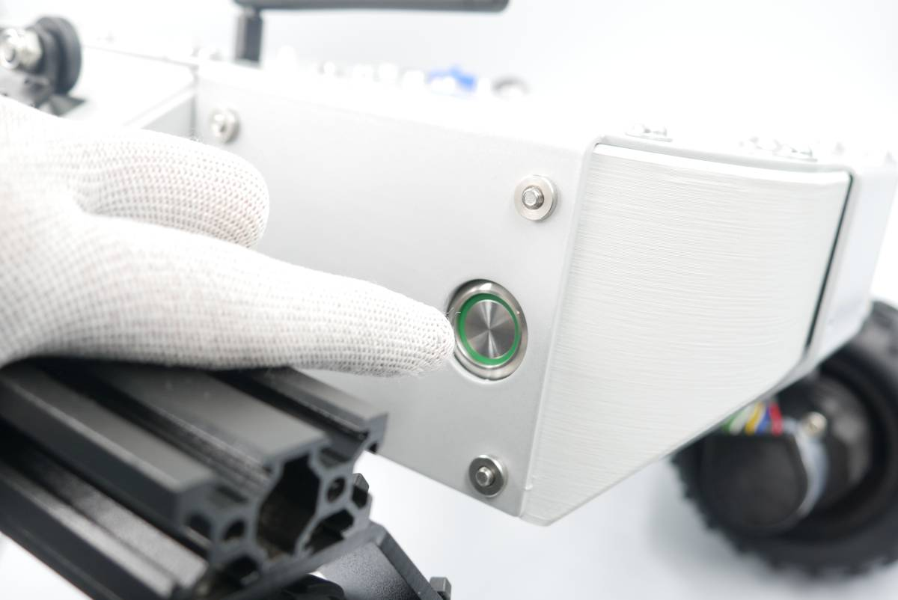
</p>

The green LED of the power button will start blinking, and after some time (15-20 seconds), you will be able to see the Wi-Fi network of the LeoRover.

> [!NOTE]
> When you turn on your robot for the first time, it will have a default name. This will happen to all the teams. Therefore, it might be confusing if everyone happens to power on their robots at the same time. You may need to coordinate with the other teams should this happen. It will only happen on the first boot. Shortly you will rename you network ID, but first we need to actually access the Leo Rover's Pi remotely.

---
<h2 align="center">Step 4: Connecting to the Leo Rover's Pi via the terminal</h2>

You should see a Leo Rover network, similar to the image below.

<p align="center">
    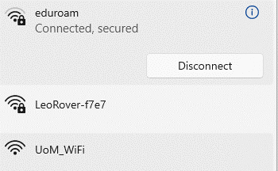
</p>

The password for all networks (for all robots) is `password` by default. Enter the password on your device and connect to your robot.

> [!TIP]
> You are not limited to connecting wirelessly, you can also connect using an ethernet cable.

Once a network connection is established you can access the user account on the Leo Rover's Raspberry Pi from the other device. Here is the account details.

**user account:** pi

**password:** raspberry

For to purpose of customising the the Network ID we care going to access the `pi` account via the terminal. 

### Remote Terminal Access ###
You have SSH client already installed on ubuntu. Open a new terminal in your computer and type:

```
ssh pi@10.0.0.1
```

The `ssh` is the Secure Shell Protocol, requesting to access the user `pi` at the IP address of `10.0.0.1`, which as been statically as part of LeoOS. 

When you're prompted for a password enter `raspberry`. You will see your terminal will have changed to `pi@leo` or similar. 

---
<h2 align="center">Step 5: Changing Wifi ID</h2>
Let us change the name of your robot's Wi-Fi network ID. To do this, open the network settings by pasting the following code into the terminal where you have SSH into the Leo Rover's Pi.

```
sudo nano /etc/hostapd/hostapd.conf
```
> [!NOTE]
> `nano` is a very helpful command line text editor, you can find all the nano keyboard shortcuts here: https://www.nano-editor.org/dist/latest/cheatsheet.html

Change the Wi-Fi name (SSID) according to your group number. For example, group 1 should name their network as 'LeoRover-GROUP1'.

<p align="center">
    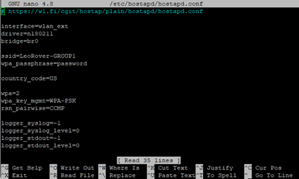
</p>

Please only change the name of the network. After renaming it , press **Ctrl+o**, **Enter**, **Ctrl+x**.

Now, your new configuration is saved. Finally, restart your network using the following code:

```
sudo systemctl restart hostapd
```
It will disconnect you from the LeoRover Network, and the Network ID will be updated as follows:

<p align="center">
    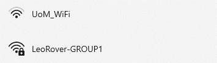
</p>


---
<h2 align="center">Step X: Connecting via Remote Desktop Connection</h2>

If you need to access more than the terminal then you need to use remotely connect to the whole desktop. To do this we can use the Remmina application

<p align="center">
    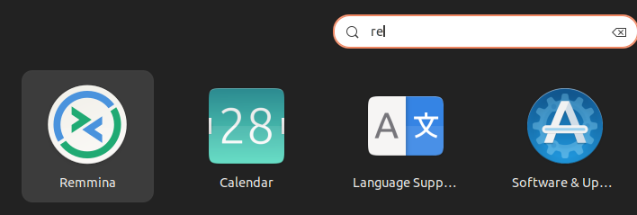
</p>

Add a new remote using button on left top corner

<p align="center">
    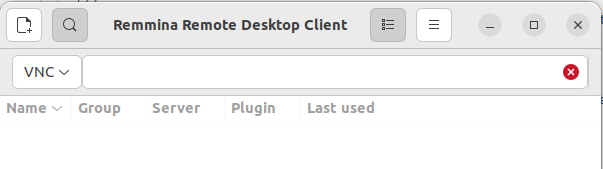
</p>

Type the IP address `10.0.0.1`, Username `pi` and password `raspberry` and then click connect.

<p align="center">
    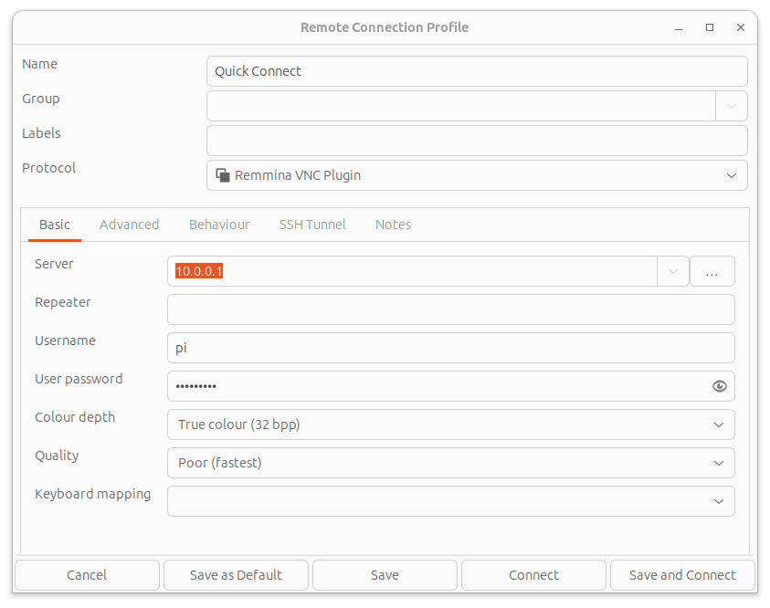
</p>

Once you connect it should ask for a password:
<p align="center">
    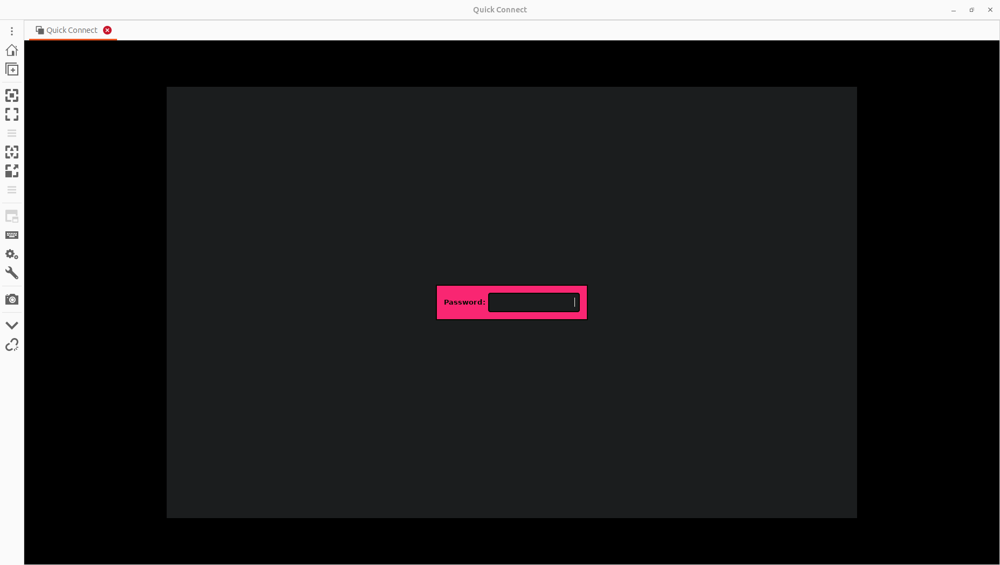
</p>

Now, you should be able to see the screen:
<p align="center">
    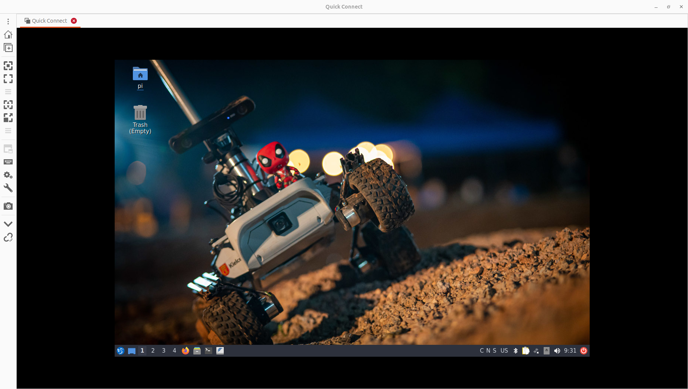
</p>


---
<h2 align="center">Step 7: Update Robot Firmware</h2>

<h3>Configure your device as an internet gateway</h3>

To update and install operating system packages, the system needs to connect to the internet.  First, open the NetworkManager Text User Interface:

```
nmtui
```

Activate a connection

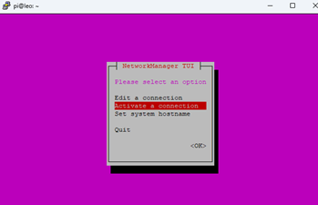

Connect to UoM_Wifi

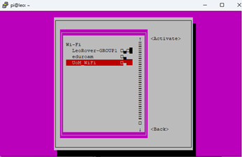

After a while, a login screen for UoM_Wifi will appear.

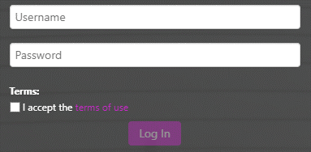

Enter your student information and connect. Verify that you have an internet connection.

<h3>Apply the updates</h3>

Check for and install update to the packages on your system. The -y flag automatically installs without prompting for confirmation. 

```
sudo apt update && sudo apt upgrade -y
```

Check if the current leo firmware requires any updates:

```
ros2 run leo_fw update
```
<p align="center">
    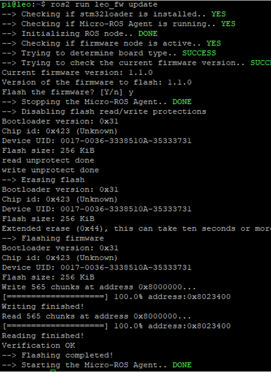
</p>


---
<h2 align="center">Step 8: Publishing and Listening ROS2 Topics</h2>
Now you should be able to publish and listen to robot-related ROS2 topics. To list all published topics:

```
ros2 topic list
```

<p align="center">
    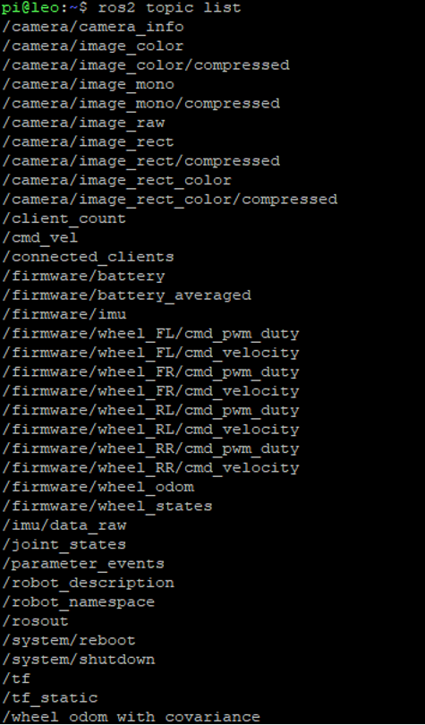
</p>

You can listen to **joint_states**:

```
ros2 topic echo /joint_states
```
<p align="center">
    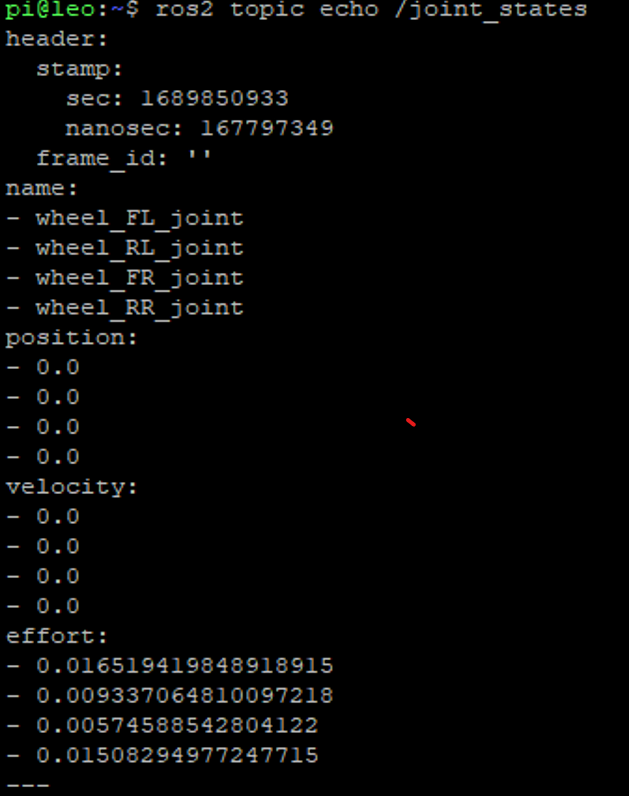
</p>

or imu data **firmware/imu**:
```
ros2 topic echo /firmware/imu
```

<p align="center">
    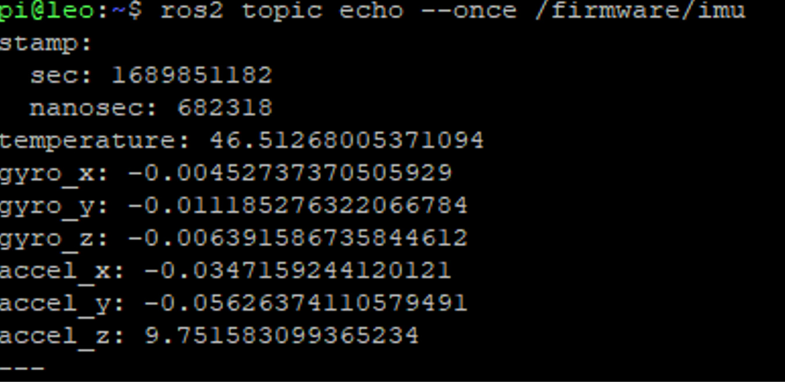
</p>

You can also send linear and angular velocities to the robot using the **cmd_vel** topic. For example, to send a forward velocity of 1 m/s for once,

```
ros2 topic pub --once /cmd_vel geometry_msgs/msg/Twist "{linear: {x: 1.0, y: 0.0, z: 0.0}, angular: {x: 0.0, y: 0.0, z: 0}}"
```

<p align="center">
    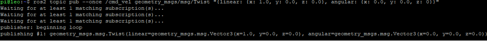
</p>

Alternatively, you can send it at a certain frequency.

```
ros2 topic pub --rate 1 /cmd_vel geometry_msgs/msg/Twist "{linear: {x: 0.2, y: 0.0, z: 0.0}, angular: {x: 0.0, y: 0.0, z: 0}}"
```
where the rate defines the frequency, which is 1 Hz in the example.

<p align="center">
    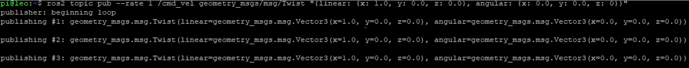
</p>

