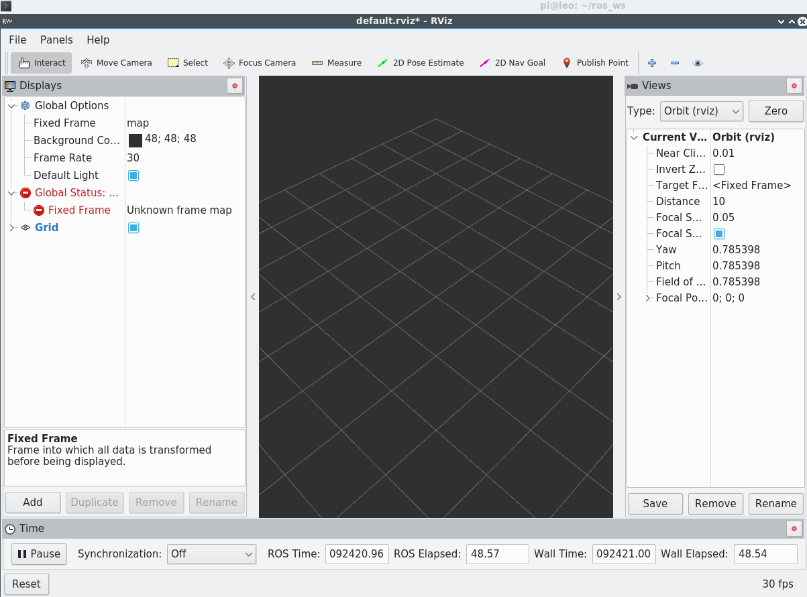
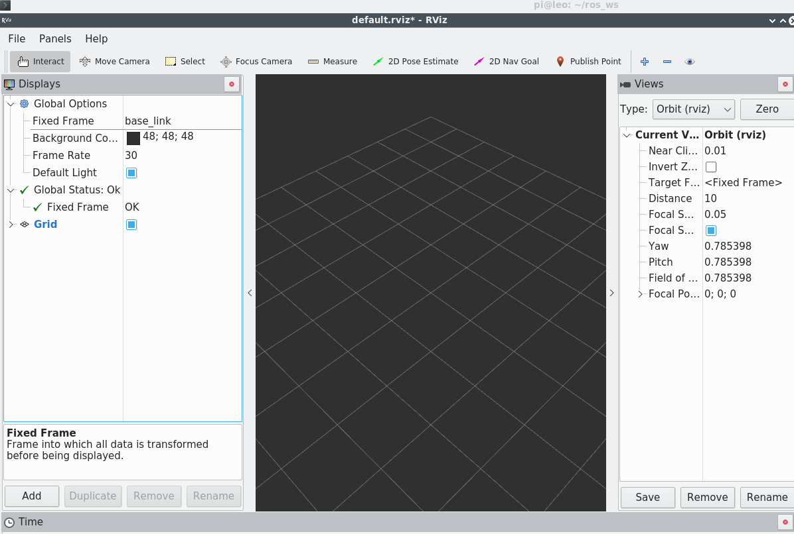
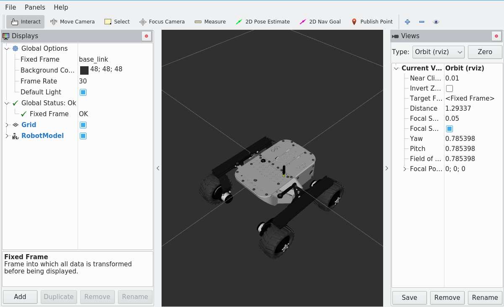
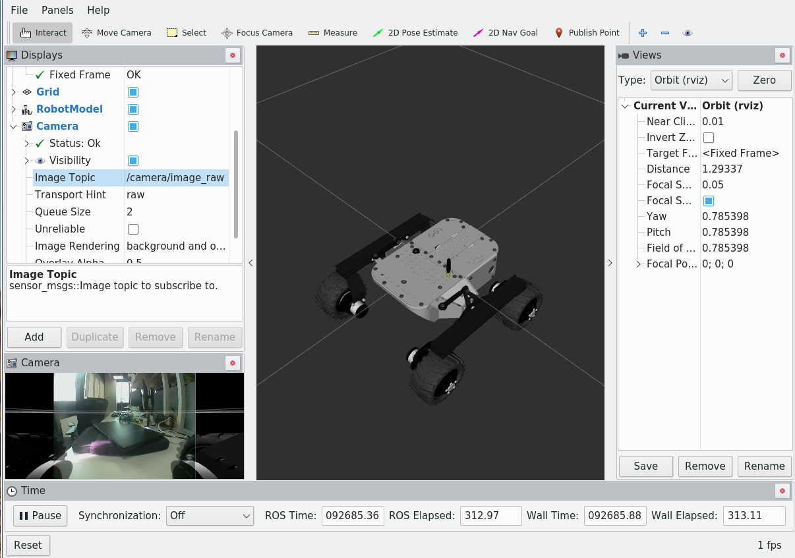
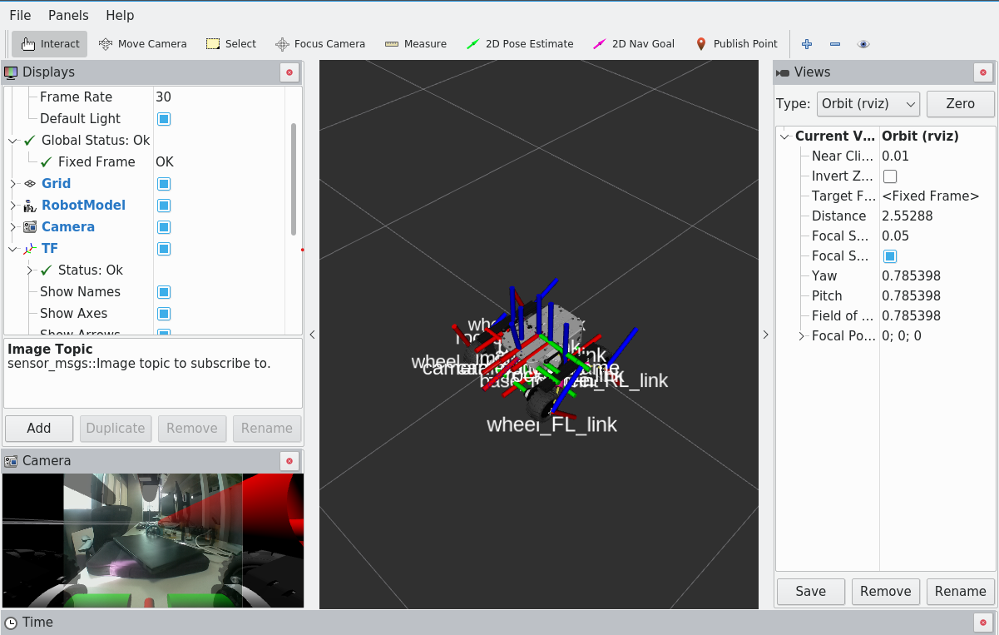

## Introduction to ROS 2

This guide will walk you through creating a ROS 2 workspace and package to control a robot. You'll write a Python node to move a robot and a launch file to run the node and visualize the robot in RViz.

-----

<h2 align="center">Step 1: Creating a ROS 2 Workspace and Package</h2>

First, you'll set up a workspace and create a ROS 2 package.

### Create a Workspace and Package

1.  Create the workspace directory:

   ```bash
   mkdir -p ~/ros2_ws/src
   cd ~/ros2_ws/src
   ```

2.  Create the ROS 2 package. Unlike ROS 1, ROS 2 uses `ament_python` for Python packages and separates the dependencies into build and execution categories.

   ```bash
   ros2 pkg create --build-type ament_python ros_basics --dependencies geometry_msgs rclpy
   ```

   This creates a package named **ros\_basics** with a `ament_python` build type and dependencies on `geometry_msgs` (for the `Twist` message type) and `rclpy` (the Python client library for ROS 2).

3.  In ROS 2, it's more common to place scripts inside the `ros_basics/ros_basics` folder.

   ```bash
   cd ros_basics/ros_basics
   ```

### Write the Python Node

1.  Create the Python script `move_robot.py` inside the `scripts` directory.

   ```bash
   touch move_robot.py
   ```

   Open the file with a text editor and copy the following ROS 2 code.

   ```python
   import rclpy
   from rclpy.node import Node
   from geometry_msgs.msg import Twist
   import time

   class BasicROS(Node):
      def __init__(self):
         super().__init__('move_robot_node')
         self.counter = 0
         self.counter_period = 5
         self.switch_direction = False
         self.vel_step = 0.1
         self.twist_cmd = Twist()
         self.cmd_vel_pub = self.create_publisher(Twist, 'cmd_vel', 10)
         self.timer_period = 1.0
         self.timer = self.create_timer(self.timer_period, self.timer_callback)

      def timer_callback(self):
         if self.counter % self.counter_period == 0:
            self.switch_direction = True
         else:
            self.switch_direction = False
         self.move_robot()
         self.counter += 1

      def move_robot(self):
         self.vel_step = -self.vel_step if self.switch_direction else self.vel_step
         self.twist_cmd.linear.x = self.vel_step
         self.twist_cmd.angular.z = 0.0
         self.cmd_vel_pub.publish(self.twist_cmd)

   def main(args=None):
      rclpy.init(args=args)
      basic_ros_node = BasicROS()
      try:
         rclpy.spin(basic_ros_node)
      except KeyboardInterrupt:
         pass
      finally:
         basic_ros_node.destroy_node()
         rclpy.shutdown()

   if __name__ == '__main__':
      main()
   ```

     * **Class inheritance**: The node class `BasicROS` inherits from `rclpy.node.Node`.
     * **Publisher**: The publisher is created with `self.create_publisher(msg_type, topic_name, qos_profile)`. The QoS profile (Quality of Service) replaces the `queue_size` parameter. The number `10` is a common QoS value.
     * **Timer**: The timer is created with `self.create_timer(timer_period_s, callback_function)`. The period is specified in seconds.
     * **Node management**: The ROS 2 client library is initialized and shut down using `rclpy.init()` and `rclpy.shutdown()`. The node is kept alive with `rclpy.spin()`.


### Update `setup.py` and `package.xml`

ROS 2 `ament_python` packages require you to specify entry points in the `setup.py` file.

1.  Open `~/ros2_ws/src/ros_basics/setup.py` and modify the `entry_points` dictionary to include your script.

   ```python
   from setuptools import find_packages, setup

   package_name = 'ros_basics'

   setup(
       name=package_name,
       version='0.0.0',
       packages=find_packages(exclude=['test']),
       data_files=[
         ('share/ament_index/resource_index/packages',
              ['resource/' + package_name]),
         ('share/' + package_name, ['package.xml']),
       ],
       install_requires=['setuptools'],
       zip_safe=True,
       maintainer='your_name',
       maintainer_email='your_name@postgrad.manchester.ac.uk',
       description='TODO: Package description',
       license='TODO: License declaration',
       tests_require=['pytest'],
       entry_points={
         'console_scripts': [
              'move_robot_node = ros_basics.move_robot:main'
         ],
       },
   )

   ```


2.  Open `~/ros2_ws/src/ros_basics/package.xml` and ensure the dependencies are listed correctly.

   ```xml
     <depend>geometry_msgs</depend>
     <depend>rclpy</depend>
   ```

3.  Build the workspace:

   ```bash
   cd ~/ros2_ws
   colcon build
   ```

   `colcon` is the standard build tool for ROS 2.

-----

<h2 align="center">Step 2: Visualize The Robot</h2>

Open a new terminal and run RViz.
```
rviz2
```
Now, you should see the following RViz window:

<p align="center">
   
</p>

### Visualizing Robot Frames and Data in RViz

After launching RViz, set the **Fixed Frame** to **base_link** for correct robot visualization.

<p align="center">
   
</p>

Next, add the robot model to RViz to see the robot's shape and structure.

<p align="center">
   
</p>

RViz can also display additional sensor and transformation data. For example, you can visualize camera streams:

<p align="center">
   
</p>

And show the robot's transformation frames (TF data):

<p align="center">
   
</p>

Explore RViz panels to visualize other available topics and data types for your robot.

You can save RViz configurations to launch it directly. To do that, create a new folder named 'rviz' inside your package.

```
cd ~/ros2_ws/src/ros_basics
mkdir rviz
```
In rviz, go to **File -> Save Config As -> ros_ws/src/ros_basics/rviz** 

Write **leo_rover.rviz** as the file name.

---
<h2 align="center">Step 3: Create a ROS 2 Launch File</h2>

Now that we have multiple terminals doing different tasks, let us simplify our lives a bit by setting up a unified launch scipt. 

1.  Create the `launch` directory.
   ```bash
   cd ~/ros2_ws/src/ros_basics
   mkdir launch
   ```
2.  Create the launch file `robot_move.launch.py` inside the `launch` directory.
   ```bash
   cd launch
   touch robot_move.launch.py
   ```
   Copy the following Python code into the file.
   ```python
   from launch import LaunchDescription
   from launch_ros.actions import Node
   from ament_index_python.packages import get_package_share_directory
   import os

   def generate_launch_description():
      ld = LaunchDescription()
   
      package_name = 'ros_basics'
      rviz_config_path = os.path.join(
         get_package_share_directory(package_name),
         'rviz',
         'leo_rover.rviz'
      )
   
      # Robot node
      robot_node = Node(
         package=package_name,
         executable='move_robot_node',
         name='robot_node',
         output='screen',
         emulate_tty=True
      )
   
      # RViz2 node
      rviz_node = Node(
         package='rviz2',
         executable='rviz2',
         name='rviz_node',
         arguments=['-d', rviz_config_path]
      )
   
      # Add actions to launch description
      ld.add_action(robot_node)
      ld.add_action(rviz_node)
   
      return ld

   ```
   This Python script defines a `generate_launch_description` function that returns a `LaunchDescription` object. It creates two `Node` actions: one for your `move_robot_node` and one for `rviz2`. 
   Using `ld.add_action` makes the code cleaner and more flexible when handling multiple nodes. You can easily add or remove nodes by commenting out their corresponding `add_action` calls, which also simplifies debugging.

### Run the Launch File
1.  Open `~/ros2_ws/src/ros_basics/setup.py` and modify the `data_files` to include the files in your rviz2 and launch directories.
   ```python
   from setuptools import find_packages, setup
   from glob import glob
   import os

   package_name = 'ros_basics'

   setup(
      name=package_name,
      version='0.0.0',
      packages=find_packages(exclude=['test']),
      data_files=[
         ('share/ament_index/resource_index/packages',
            ['resource/' + package_name]),
         ('share/' + package_name, ['package.xml']),
         # Installs all launch files
         (os.path.join('share', package_name, 'launch'),
            glob(os.path.join('launch', '*launch.[pxy][yma]*'))),
         # Installs all RViz configs
         (os.path.join('share', package_name, 'rviz'),
            glob(os.path.join('rviz', '*.rviz'))),
      ],
      install_requires=['setuptools'],
      zip_safe=True,
      maintainer='your_name',
      maintainer_email='your_name@postgrad.manchester.ac.uk',
      description='TODO: Package description',
      license='TODO: License declaration',
      tests_require=['pytest'],
      entry_points={
         'console_scripts': [
            'move_robot_node = ros_basics.move_robot:main'
         ],
      },
   )
   ```


   💡 **What’s happening with `os` and `glob` here?**

   * `glob(os.path.join('launch', '*launch.[pxy][yma]*'))`
   Finds all launch files in the `launch/` directory that match ROS 2’s common extensions (`.launch.py`, `.launch.xml`, `.launch.yaml`).

   * `glob(os.path.join('rviz', '*.rviz'))`
   Finds all `.rviz` config files in the `rviz/` directory.

   * `os.path.join('share', package_name, 'launch')`
   Tells colcon where to install the files so they end up in `install/ros_basics/share/ros_basics/launch`.

   This way, when you run `ros2 launch ros_basics <file>.launch.py` or `rviz2 -d $(ros2 pkg prefix ros_basics)/share/ros_basics/rviz/leo_rover.rviz`, ROS 2 knows exactly where to look.

2.  Build the workspace again to ensure the new launch file and data paths are installed.
   ```bash
   cd ~/ros2_ws
   colcon build
   ```
3.  Source the workspace and run the launch file.
   ```bash
   source install/setup.bash
   ros2 launch ros_basics robot_move.launch.py
   ```
   This command will start both the Python node and RViz 2 with your saved configuration.