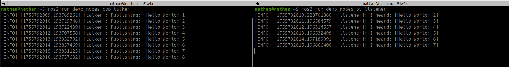

## ROS 2 Fundamentals with the LeoRover Simulator

In this guide, you will learn the basic structure of a ROS 2 system by installing and exploring the LeoRover simulator, No physical robot is required. Everything runs on your laptop.

By the end, you should understand:

```text
Workspace
    ↓
Package
    ↓
Node
    ↓
Topic
    ↓
Message
```

<h2 align="center">Installing ROS2 Jazzy on your laptop</h2>

### Set Locale ###
```
locale  # check for UTF-8

sudo apt update && sudo apt install locales
sudo locale-gen en_US en_US.UTF-8
sudo update-locale LC_ALL=en_US.UTF-8 LANG=en_US.UTF-8
export LANG=en_US.UTF-8

locale  # verify settings
```
### Setup Sources ###

```
sudo apt install software-properties-common
sudo add-apt-repository universe
```

```
sudo apt update && sudo apt install curl -y
export ROS_APT_SOURCE_VERSION=$(curl -s https://api.github.com/repos/ros-infrastructure/ros-apt-source/releases/latest | grep -F "tag_name" | awk -F\" '{print $4}')
```

```
curl -L -o /tmp/ros2-apt-source.deb "https://github.com/ros-infrastructure/ros-apt-source/releases/download/${ROS_APT_SOURCE_VERSION}/ros2-apt-source_${ROS_APT_SOURCE_VERSION}.$(. /etc/os-release && echo $VERSION_CODENAME)_all.deb" # If using Ubuntu derivates use $UBUNTU_CODENAME
sudo dpkg -i /tmp/ros2-apt-source.deb
```
### Install ROS 2 packages ###

```
sudo apt update
```
```
sudo apt upgrade
```
```
sudo apt install ros-jazzy-desktop
```
```
sudo apt install ros-dev-tools
```

To test your installation, please open two terminal windows and source your ROS2 workspace in both of them:

```
source /opt/ros/jazzy/setup.bash
```

In one of the terminals, run a data publisher node:
```
ros2 run demo_nodes_cpp talker
```
In the other terminal, run a data listener node:

```
ros2 run demo_nodes_py listener
```

You should see the following output:




### Automating sourcing your workspace(s)

To automatically source the ROS2 workspace, you need to edit `~/.bashrc`. `~/.bashrc` is a hidden configuration script in your home directory that the Bash shell runs automatically every time you open a new interactive terminal session. You can edit it by:
```
nano ~/.bashrc
```
Reminder: [nano keyboard shortcuts](https://www.nano-editor.org/dist/latest/cheatsheet.html)

Add to the end of bashrc:

```
# Source ROS Jazzy setup with error checking
if source /opt/ros/jazzy/setup.bash; then
  echo "Sourced /opt/ros/jazzy/setup.bash successfully"
else
  echo "Failed to source /opt/ros/jazzy/setup.bash"
fi


# You can also set ROS environment variables 
export RMW_IMPLEMENTATION=rmw_fastrtps_cpp
echo "ROS Middleware set to $RMW_IMPLEMENTATION"
```

Then

```
source ~/.bashrc
```
You should see the echo output as you open a new terminal.

> [!IMPORTANT]
> Highly recommend automating sourcing of your ROS2 workspace! Adding echo to describe what is happening is incredibly useful in a team project.


[The ROS2 Jazzy installation docs.](https://docs.ros.org/en/jazzy/Installation.html)


---
<h2 align="center">Step 1: Understanding ROS 2 Structure</h2>

A useful way to think about ROS 2 is:

```
~/leosim_ws                         ← Workspace
     │
     ├── leo_simulator              ← Package
     ├── leo_gz_bringup             ← Package
     └── leo_description            ← Package
              │
        running programs           ← Nodes
              │
              └── /cmd_vel          ← Topic
                       │
                       └── geometry_msgs/msg/Twist ← Message
```

These terms describe different parts of a ROS 2 system.

### Workspace

A **workspace** is a directory containing ROS 2 packages.

```text
~/leosim_ws
```

The workspace itself is not a ROS package.

A typical workspace looks like:

```text
leosim_ws/
├── src/
├── build/
├── install/
└── log/
```

You normally edit or download packages into:

```text
src/
```

and build the workspace from:

```text
~/leosim_ws
```

---

### Package

A **package** groups related ROS 2 software.

For example, the LeoRover simulator repository contains packages including:

```text
leo_simulator
leo_gz_bringup
leo_gz_plugins
leo_gz_worlds
```

`leo_gz_bringup`, for example, contains launch files used to start the simulation.

One workspace can contain many packages.

---

### Node

A **node** is a running ROS 2 program.

When the LeoRover simulation starts, several nodes run at the same time.

You can see them with:

```bash
ros2 node list
```

Nodes perform individual jobs and communicate with other nodes.

---

### Topic

A **topic** is a named communication channel.

For example:

```text
/cmd_vel
```

is used to send movement commands.

A node can:

```text
publish → topic → subscribe
```

For example:

```text
Controller
    │
    │ publishes
    ▼
 /cmd_vel
    │
    │ subscribes
    ▼
LeoRover simulation
```

---

### Message

Topics carry **messages**.

The `/cmd_vel` topic uses:

```text
geometry_msgs/msg/Twist
```

So our full relationship becomes:

```text
~/leosim_ws                         ← Workspace
     │
     └── leo_gz_bringup             ← Package
              │
              └── simulation node   ← Node
                       │
                       └── /cmd_vel  ← Topic
                              │
                              └── geometry_msgs/msg/Twist
                                                   ↑
                                                Message
```

---
<h2 align="center">Step 2: Create a Simulation Workspace</h2>

**Create a simulation workspace:**

```bash
mkdir -p ~/leosim_ws/src
```

Move into the source directory:

```bash
cd ~/leosim_ws/src
```

You now have:

```text
leosim_ws/
└── src/
```


**Clone the LeoRover simulator:**

```bash
git clone -b ros2 https://github.com/LeoRover/leo_simulator-ros2.git
```

> ROS 2 Jazzy uses the `ros2` branch of the LeoRover simulator rather than the older `humble` branch.

Now download the common LeoRover packages:

```bash
git clone -b ros2 https://github.com/LeoRover/leo_common-ros2.git
```

The common repository contains packages including the robot description and Leo-specific message definitions.

Your workspace now looks approximately like:

```text
leosim_ws/
└── src/
    ├── leo_simulator-ros2/
    │   ├── leo_simulator/
    │   ├── leo_gz_bringup/
    │   ├── leo_gz_plugins/
    │   └── leo_gz_worlds/
    │
    └── leo_common-ros2/
        ├── leo/
        ├── leo_description/
        ├── leo_msgs/
        └── leo_teleop/
```

Mpve back to the workspace:

```bash
cd ~/leosim_ws
```

Run:

```bash
colcon list
```

`colcon` searches the `src` directory and lists the ROS packages it can build.

You should see several packages, such as:

```text
leo_description
leo_gz_bringup
leo_gz_plugins
leo_gz_worlds
leo_msgs
leo_simulator
```

This gives us:

```text
Workspace
    │
    ├── Package
    ├── Package
    ├── Package
    └── Package
```

**Install the required dependencies using:**

```bash
cd ~/leosim_ws

rosdep update

rosdep install \
  --from-paths src \
  --ignore-src \
  -r \
  -y
```

`rosdep` examines the packages and installs dependencies that are not already present.

**Build the workspace:**

```bash
cd ~/leosim_ws
colcon build --symlink-install
```

After building, you should see:

```text
leosim_ws/
├── src/
├── build/
├── install/
└── log/
```

The important directory is:

```text
install/
```

It contains the environment information ROS 2 needs to find the packages you have just built.


---
<h2 align="center">Step 3: Source the Workspace </h2>

In order for ROS 2 to use the new packages, you need to source the workspace:

```bash
source ~/leosim_ws/install/setup.bash
```

Now try:

```bash
ros2 pkg list | grep leo
```

You should see several LeoRover packages.

We could automate this workspace being sourced by editing `~/.bashrc`. This workspace is only needed when using the simulator.

Rather than automatically loading it every time a terminal starts, we will manually run:

```bash
source ~/leosim_ws/install/setup.bash
```

when we want to use the simulation.

---
<h2 align="center">Step 4: Start the LeoRover Simulation</h2>

Launch the simulator:

```bash
ros2 launch leo_gz_bringup leo_gz.launch.py
```

Gazebo should open with a simulated LeoRover.

The official Leo simulator uses `leo_gz_bringup` to start Gazebo and spawn the rover.

Leave this terminal running.

**To inspect the ROS nodes, open a new terminal.**

Source the simulation workspace:

```bash
source ~/leosim_ws/install/setup.bash
```

Now run:

```bash
ros2 node list
```

You should see several nodes.

ROS robots normally consist of **many small nodes working together**, rather than one large program.

Try inspecting one:

```bash
ros2 node info <node_name>
```

Copy a node name from `ros2 node list` and replace `<node_name>`.

This shows which topics that node publishes and subscribes to.


**You can also inspect topics.**

ist the active topics:

```bash
ros2 topic list
```

Look for:

```text
/cmd_vel
```

This is the velocity-command topic.

Check its message type:

```bash
ros2 topic type /cmd_vel
```

You should see:

```text
geometry_msgs/msg/Twist
```

So:

```text
/cmd_vel                    ← Topic
     │
     └── geometry_msgs/msg/Twist
                         ↑
                      Message type
```

**To inspect a message**

Ask ROS 2 what a `Twist` message contains:

```bash
ros2 interface show geometry_msgs/msg/Twist
```

You will see two vectors:

```text
Vector3 linear
Vector3 angular
```

For a mobile robot, two important values are:

```text
linear.x
angular.z
```

They represent:

```text
linear.x   → forward / backward movement

angular.z  → left / right rotation
```

---
<h2 align="center">Step 5: Send a message</h2>

We can control the simulated rover directly from the terminal.

Publish forward velocity at 5 Hz:

```bash
ros2 topic pub --rate 5 \
  /cmd_vel \
  geometry_msgs/msg/Twist \
  "{linear: {x: 0.2}, angular: {z: 0.0}}"
```

The rover should move forwards.

Press:

```text
Ctrl+C
```

to stop publishing.

Send an explicit stop command:

```bash
ros2 topic pub --once \
  /cmd_vel \
  geometry_msgs/msg/Twist \
  "{linear: {x: 0.0}, angular: {z: 0.0}}"
```

You have now acted as a ROS 2 **publisher**.

```text
Terminal
   │
   │ publishes Twist messages
   ▼
/cmd_vel
   │
   ▼
LeoRover simulation
```

---
<h2 align="center">Step 6: Visualise ROS with `rqt_graph`</h2>

ROS also provides graphical tools for inspecting a system.

Run:

```bash
rqt_graph
```

If required, it can also be started with:

```bash
ros2 run rqt_graph rqt_graph
```

where: 
```text
ros2 run  rqt_graph      rqt_graph
         └ package ┘ └ executable ┘
```


`rqt_graph` displays nodes and the topics connecting them.

Conceptually, you are looking at:

```text
┌──────────┐          ┌──────────┐
│  Node A  │          │  Node B  │
└────┬─────┘          └────▲─────┘
     │                     │
     │ publishes           │ subscribes
     │                     │
     └────── /topic ───────┘
```

This is often easier to understand than a long list of nodes and topics.

`rqt_graph` is specifically designed to visualise the ROS computation graph: nodes, topics and their connections.


---
<h2 align="center">Step 7: Visualise coordinate frames`</h2>

Robots contain many coordinate systems called **frames**.

For example, LeoRover has a frame associated with its main body and frames associated with wheels and sensors.

Conceptually:

```text
        base_link
        /   |   \
       /    |    \
 wheel   sensor   wheel
```

ROS 2 uses **TF2** to keep track of the position and orientation of these frames relative to each other.

To visualise:

```bash
ros2 run tf2_tools view_frames
```

It listens to TF data and generates:

```text
frames.pdf
```

The resulting diagram shows how the robot's coordinate frames are connected.

ROS 2 also provides the graphical `rqt_tf_tree` tool:

```bash
ros2 run rqt_tf_tree rqt_tf_tree
```

This provides an interactive view of the TF frame tree.

TF2's `view_frames` tool is specifically intended to generate a diagram of the transforms being broadcast by a ROS 2 system.

---
<h2 align="center">Step 8: Visualise the Robot with RViz</h2>

RViz allows us to visualise data being published by ROS 2, including:

* the robot model;
* coordinate frames;
* sensor data;
* paths and maps.

**Gazebo vs RViz**

Gazebo and RViz serve different purposes:

```text
Gazebo                          RViz
   │                              │
   ├── simulates physics          ├── visualises ROS data
   ├── simulates sensors          ├── displays robot models
   └── simulates the world        └── displays TF and sensor data
```

In this tutorial:

```text
Gazebo → creates the simulated LeoRover

RViz   → shows the ROS 2 data produced by the simulation
```

---

**Start RViz**

Leave the LeoRover simulation running.

Open a new terminal and source the simulation workspace:

```bash
source ~/leosim_ws/install/setup.bash
```

Start RViz:

```bash
rviz2
```

The RViz window should open.

---

**Set the Fixed Frame**

RViz needs a reference coordinate frame from which to display the robot.

In the **Global Options** panel, find:

```text
Fixed Frame
```

Set it to a suitable frame from the LeoRover TF tree, for example:

```text
base_link
```

If you are unsure which frames are available, you can inspect them using the TF tools from the previous section.

---

**Display the Robot Model**

Click:

*Add → RobotModel*

RViz should display the LeoRover model.

The model is created from the robot description and positioned using information from **TF**.

This connects several ROS concepts:

```text
Robot description
       │
       ▼
 RobotModel
       │
       +──── TF ────► position of each part
       │
       ▼
     RViz
```

---

**Display the TF Frames**

Click:

*Add → TF*

You should now see coordinate axes attached to parts of the robot.

For example:

```text
        base_link
        /   |   \
       /    |    \
   wheel  sensor  wheel
```

These are the same coordinate frames that you explored using:

```bash
ros2 run tf2_tools view_frames
```

and:

```bash
ros2 run rqt_tf_tree rqt_tf_tree
```

RViz simply gives us another way to visualise them.

---

**Explore ROS Data**

RViz can display many different ROS message types.

Click **Add** and explore the available displays.

When you start building your robot system, you may see options such as:

```text
Image
LaserScan
PointCloud2
Odometry
Path
TF
RobotModel
```

These displays subscribe to ROS 2 topics and visualise the messages they receive.

Conceptually:

```text
ROS Node
   │
   │ publishes
   ▼
 Topic
   │
   │ carries messages
   ▼
 RViz
   │
   ▼
Visual representation
```

For example, a camera node might publish:

```text
Camera node
     │
     ▼
camera topic
     │
     ▼
Image message
     │
     ▼
RViz Image display
```

---
<h2 align="center">Summary</h2>

To overview the main concepts:

```text
~/leosim_ws                              ← Workspace
     │
     ├── leo_gz_bringup                  ← Package
     ├── leo_description                 ← Package
     └── other Leo packages
              │
              ▼
         Running Nodes
              │
              ▼
           Topics
              │
              ├── /cmd_vel
              ├── /tf
              └── /tf_static
                     │
                     ▼
                  Messages
```

Concept overview:

```text
Workspace → organises packages

Package   → groups related ROS software

Node      → a running ROS program

Topic     → a communication channel

Message   → the data sent through a topic
```

You then used several different tools to inspect the  ROS 2 system:

```text
ros2 node list
      │
      └── What nodes are running?


ros2 topic list
      │
      └── What communication channels exist?


rqt_graph
      │
      └── How are nodes and topics connected?


TF tools
      │
      └── How are coordinate frames related?


RViz
      │
      └── What does the ROS data look like?
```

