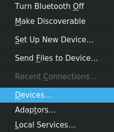
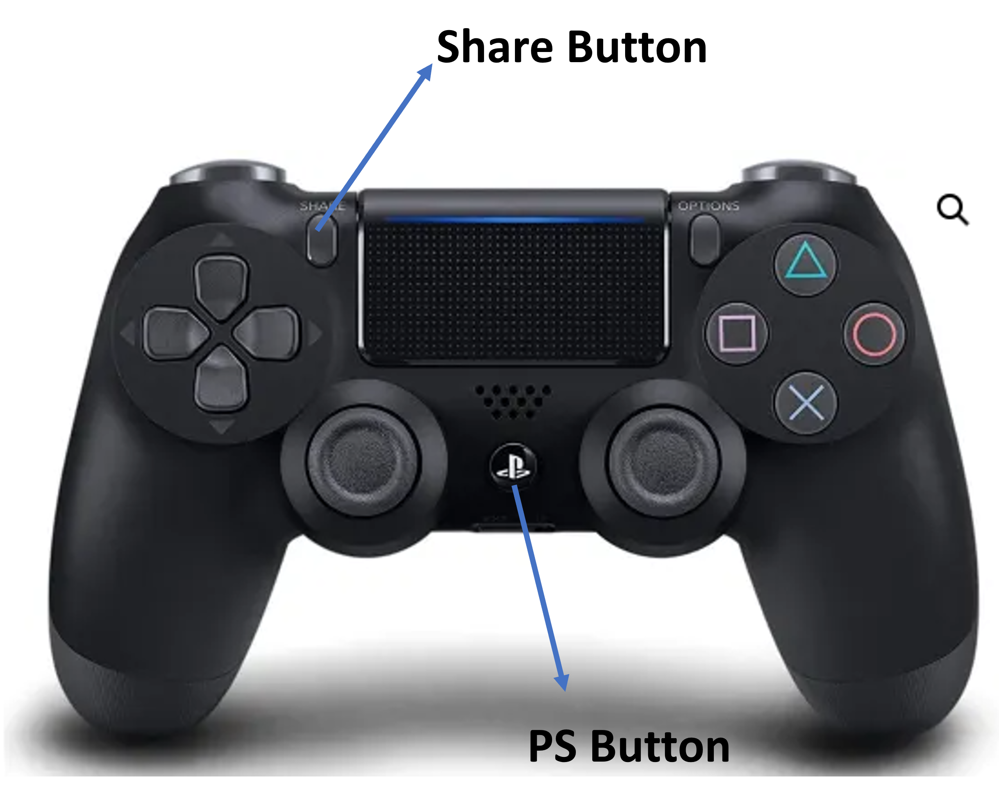
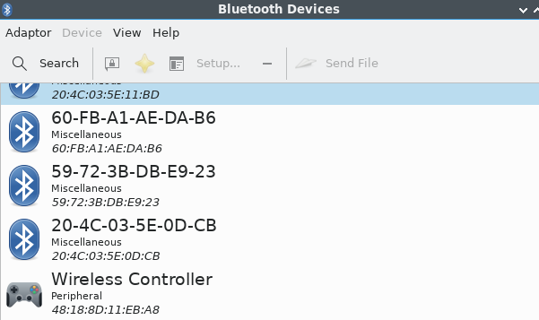
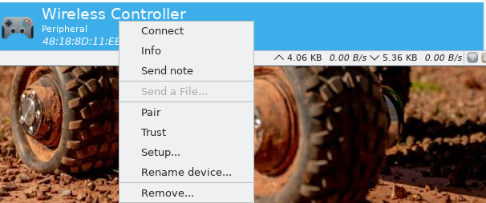
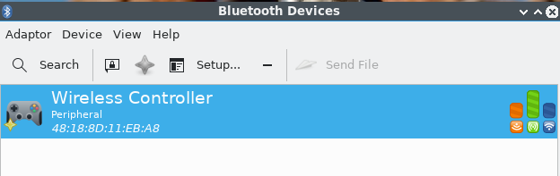
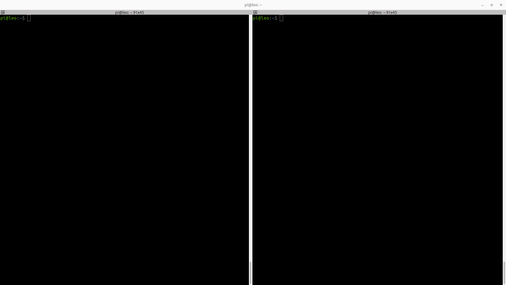
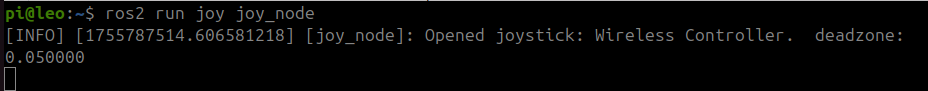
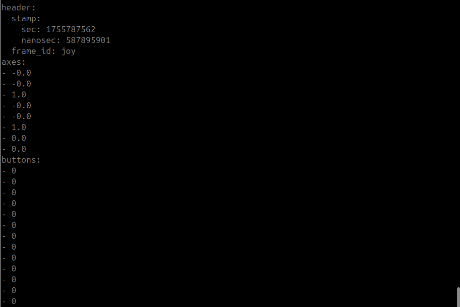
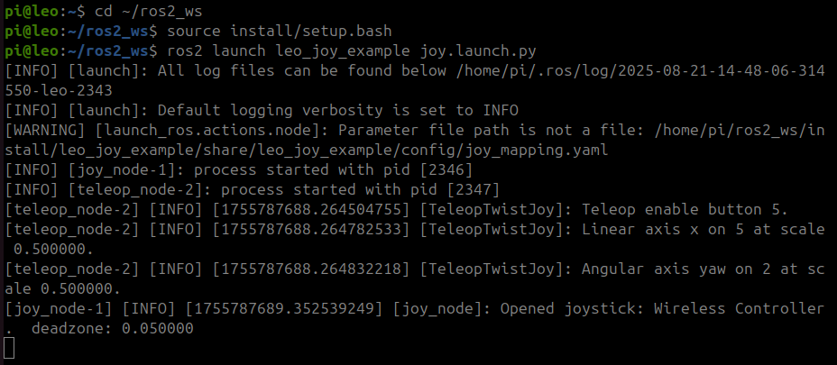

<h1 align="center"> Steering with graphical user interface (GUI) </h1>

In this section, you will create your own ROS 2 node: a graphical controller that runs on your laptop and sends velocity commands to a physical LeoRover.

```text
YOUR LAPTOP/NUC                         LEO ROVER

GUI Controller
     │
     │ publishes Twist
     ▼
 /cmd_vel
     │
     └────────── Network ─────────────► Rover controller
                       DDS
```

*The same controller can also be used with the LeoRover simulator.*


---
<h2 align="center">Python Package Management and ROS 2</h2>

ROS 2 Python development is slightly different from general-purpose Python development.

Different types of dependencies should be installed in different ways:

```text
ROS 2 packages
     │
     └── rosdep / apt
         e.g. rclpy, geometry_msgs

System Python packages
     │
     └── apt
         e.g. python3-tk

PyPI-only Python packages
     │
     └── pip inside a virtual environment
```

### Avoid Anaconda / Conda for ROS 2

ROS 2 Jazzy binary packages are built against the **system Python interpreter**.

The official ROS 2 documentation warns that Conda commonly provides a different Python interpreter and is therefore likely to be incompatible with pre-built ROS 2 binaries.

For these tutorials, use:

```bash
python3
```

from Ubuntu.

### Do we need a virtual environment?

For this controller, **no**.

Our Python dependencies are:

```text
rclpy          → supplied by ROS 2
geometry_msgs  → supplied by ROS 2
tkinter        → supplied by Ubuntu
```

Therefore, we do not need a `requirements.txt` or pip installation.

Install Tkinter with:

```bash
sudo apt update
sudo apt install python3-tk
```

### When should you use a virtual environment?

If you later add a package that is only available through PyPI, a virtual environment is useful.

For example:

```bash
cd ~/ros2_ws

python3 -m venv .venv
source .venv/bin/activate
```

Because the virtual environment is inside a colcon workspace, prevent colcon from trying to inspect it:

```bash
touch .venv/COLCON_IGNORE
```

Then install your additional Python package:

```bash
python3 -m pip install <package>
```

When finished:

```bash
deactivate
```

> Use a virtual environment created from the system `python3`. Do not use Conda/Anaconda for this ROS 2 environment.

ROS 2 officially supports virtual environments using the system interpreter and recommends `rosdep` where dependencies are available through the ROS ecosystem.


---
<h2 align="center">Create the GUI Package</h2>
We will use our development workspace:

```text
~/ros2_ws
```

Move into its source directory:

```bash
cd ~/ros2_ws/src
```

*If you don't have the `ros2_ws/src` workspace, create it using `mkdir -p ~/ros2_ws/src`.*

Create a Python ROS 2 package:

```bash
ros2 pkg create gui_controller_leo \
  --build-type ament_python \
  --license Apache-2.0 \
  --dependencies rclpy geometry_msgs
```

The important part of our workspace is now:

```text
~/ros2_ws                         ← Workspace
    │
    └── gui_controller_leo       ← Package
              │
              └── gui_controller ← Node we will create
```

The `--dependencies` option automatically adds the ROS dependencies to `package.xml`.

You can inspect them:

```bash
grep depend ~/ros2_ws/src/gui_controller_leo/package.xml
```

You should see:

```xml
<depend>rclpy</depend>
<depend>geometry_msgs</depend>
```

ROS 2 uses `package.xml` to describe package metadata and dependencies.

---
<h2 align="center">Create the GUI Node</h2>

A Python ROS 2 package contains an inner Python folder where the node code lives.

For our package:

```text
gui_controller_leo/              ← ROS 2 package
└── gui_controller_leo/          ← Python module
    └── gui_controller.py        ← ROS 2 node code, which will we create next.
```

Move into the Python module:

```bash
cd ~/ros2_ws/src/gui_controller_leo/gui_controller_leo
```

Create:

```bash
nano gui_controller.py
```

Add:

```python
import tkinter as tk

import rclpy
from rclpy.node import Node
from geometry_msgs.msg import Twist


class GUIController(Node):

    def __init__(self):
        super().__init__('gui_controller')

        # Publish velocity commands
        self.publisher = self.create_publisher(
            Twist,
            'cmd_vel',
            10
        )

        self.linear_velocity = 0.0
        self.angular_velocity = 0.0

        # Create GUI
        self.root = tk.Tk()
        self.root.title('LeoRover Controller')

        self.create_gui()

        # Publish at 10 Hz
        self.root.after(100, self.publish_command)

        # Stop when the window closes
        self.root.protocol(
            'WM_DELETE_WINDOW',
            self.close_gui
        )

    def create_gui(self):

        forward = tk.Button(self.root, text='Forward', width=12)
        backward = tk.Button(self.root, text='Backward', width=12)
        left = tk.Button(self.root, text='Left', width=12)
        right = tk.Button(self.root, text='Right', width=12)

        stop = tk.Button(
            self.root,
            text='STOP',
            width=12,
            command=self.stop
        )

        forward.grid(row=0, column=1, padx=5, pady=5)
        left.grid(row=1, column=0, padx=5, pady=5)
        stop.grid(row=1, column=1, padx=5, pady=5)
        right.grid(row=1, column=2, padx=5, pady=5)
        backward.grid(row=2, column=1, padx=5, pady=5)

        forward.bind(
            '<ButtonPress-1>',
            lambda event: self.set_velocity(0.2, 0.0)
        )

        backward.bind(
            '<ButtonPress-1>',
            lambda event: self.set_velocity(-0.2, 0.0)
        )

        left.bind(
            '<ButtonPress-1>',
            lambda event: self.set_velocity(0.0, 0.6)
        )

        right.bind(
            '<ButtonPress-1>',
            lambda event: self.set_velocity(0.0, -0.6)
        )

        # Releasing the mouse stops the rover
        self.root.bind(
            '<ButtonRelease-1>',
            lambda event: self.stop()
        )

    def set_velocity(self, linear, angular):
        self.linear_velocity = linear
        self.angular_velocity = angular

    def stop(self):
        self.linear_velocity = 0.0
        self.angular_velocity = 0.0

    def publish_command(self):

        msg = Twist()

        msg.linear.x = self.linear_velocity
        msg.angular.z = self.angular_velocity

        self.publisher.publish(msg)

        # Publish again after 100 ms
        self.root.after(100, self.publish_command)

    def close_gui(self):

        # Send a final stop command
        self.publisher.publish(Twist())

        self.root.destroy()

    def run(self):
        self.root.mainloop()


def main(args=None):

    rclpy.init(args=args)

    controller = GUIController()

    try:
        controller.run()
    finally:
        controller.destroy_node()
        rclpy.shutdown()


if __name__ == '__main__':
    main()
```

Save:

**Ctrl+O → Enter → Ctrl+X**

Let us have a look at some aspects of the code

`class GUIController(Node):` creates our ROS node, the node class `GUIController` inherits from `rclpy.node.Node`, since we `from rclpy.node import Node`.


Below is where we publish the `Twist` message to to `cmd_vel` topic. We also include the argument `10` for QoS history depth.
```python
self.publisher = self.create_publisher(
    Twist,
    'cmd_vel',
    10
)
```

Our GUI published a command, `self.root.after(100, self.publish_command)` at 10Hz, `00 ms = 10 Hz. LeoRover has a default command timeout of **500 ms**. If velocity commands stop arriving, the controller disables the command.


**ROS 2 needs to know how to start our Python program, let us make the Node Executable**

```bash
cd ~/ros2_ws/src/gui_controller_leo
nano setup.py
```

Find:

```python
entry_points={
    'console_scripts': [
    ],
},
```

Change it to:

```python
entry_points={
    'console_scripts': [
        'gui_controller = gui_controller_leo.gui_controller:main',
    ],
},
```

This connects:

```text
ros2 run gui_controller_leo gui_controller
         └──── package ────┘ └ executable ┘
```

to:

```text
gui_controller.py
       │
       ▼
     main()
```

**Return to the workspace, to install Dependencies and Build**

```bash
cd ~/ros2_ws
```

Check and install declared dependencies:

```bash
rosdep install \
  --from-paths src \
  --ignore-src \
  -r \
  -y
```

Build the package:

```bash
colcon build \
  --symlink-install \
  --packages-select gui_controller_leo
```

`--symlink-install` is useful during Python development because changes to source files can be reflected without copying them into the install space each time. Current LeoRover development guidance also recommends this option during active development.

Source the workspace:

```bash
source ~/ros2_ws/install/setup.bash
```


---
<h2 align="center">Test GUI with simulator (optional)</h2>

If you completed the LeoRover simulation setup in **Task 03**, you can also test the GUI in simulation before using the physical rover.

Open a new terminal and source the simulation workspace:

```bash
source ~/leosim_ws/install/setup.bash
```

Launch the LeoRover simulator:

```bash
ros2 launch leo_gz_bringup leo_gz.launch.py
```

In another terminal, source your GUI workspace:

```bash
source ~/ros2_ws/install/setup.bash
```

Run the controller:

```bash
ros2 run gui_controller_leo gui_controller
```

The GUI should now control the simulated rover:

```text
GUI Controller
      │
      │ Twist
      ▼
   /cmd_vel
      │
      ▼
LeoRover Simulation
      │
      ▼
    Gazebo
```

---
<h2 align="center">Test with physical robot</h2>

Run the GUI on **your laptop**.

Connect the laptop either:

* to the LeoRover Wi-Fi access point; or
* to the same local network as LeoRover via ethernet cable.

ROS 2 nodes on the same network can automatically discover one another when they use the same ROS Domain ID.

Conceptually:

```text
YOUR LAPTOP                             LEO ROVER

GUI node                               Controller node
   │                                         ▲
   │ publish                                 │ subscribe
   ▼                                         │
/cmd_vel ─────────────── DDS ─────────────────┘
                 network
```

ROS 2 uses a middleware layer for communication. The standard ROS 2 middleware implementations use **DDS — Data Distribution Service** for discovery and publish/subscribe communication.

### Check the ROS Domain

Check your laptop:

```bash
printenv ROS_DOMAIN_ID
```

If required set the ROS_DOMAIN_ID to your team number, for example if you're team 21 then
```bash
export ROS_DOMAIN_ID=21
```

Your laptop and Leo Rover must use the same Domain ID. You may need to ssh into the leo rover's pi to check.

On your laptop run: 

```bash
ros2 node list
```

You should see nodes running on LeoRover.

At this point you have ROS nodes running on **different computers**, but participating in the same ROS 2 graph.

```text
Laptop                             Rover
  │                                  │
GUI Node                      Controller Node
  │                                  ▲
  └──────── /cmd_vel : Twist ────────┘
                 DDS
```

> [!WARNING]
> Before using the GUI ensure you are in the arena where driving is permitted or you have your Leo Rover raised so the wheels are not in contact with any surfaces.

If not already source the `ros_ws`:
```bash
source ~/ros2_ws/install/setup.bash
```
Then run:

```bash
ros2 run gui_controller_leo gui_controller
```

Hold **Forward** briefly.

The data path is now:

```text
Tkinter button
      │
      ▼
GUI ROS node
      │
      │ Twist
      ▼
   /cmd_vel
      │
      │ DDS over network
      ▼
LeoRover controller
      │
      ▼
    Motors
```

Release the button to command zero velocity.


---
<h2 align="center">Configure the GUI with ROS 2 Parameters/h2>

t the moment, values such as the driving speed are written directly in our Python code:

```python
0.2
0.6
```

This works, but changing the robot's speed would require editing the program.

ROS 2 provides **parameters** so that settings can be kept separate from the node code.

```text
GUI node
   │
   └── Parameters
          │
          ├── linear_speed
          ├── angular_speed
          ├── publish_period_ms
          └── cmd_vel_topic
```

This is useful because the same program can be configured differently without changing its Python code.

### Create a Configuration Folder

Move to the package:

```bash
cd ~/ros2_ws/src/gui_controller_leo
```

Create a configuration directory:

```bash
mkdir -p config
```

Create the configuration file:

```bash
nano config/gui_controller.yaml
```

Add:

```yaml
gui_controller:
  ros__parameters:
    cmd_vel_topic: cmd_vel
    linear_speed: 0.2
    angular_speed: 0.6
    publish_period_ms: 100
```

These parameters control:

```text
linear_speed       → forward/backward speed

angular_speed      → turning speed

publish_period_ms  → how often commands are published

cmd_vel_topic      → velocity command topic
```

---

### Read the Parameters in Python

In `gui_controller.py`, add the parameters near the start of `__init__()`:

```python
self.declare_parameter('cmd_vel_topic', 'cmd_vel')
self.declare_parameter('linear_speed', 0.2)
self.declare_parameter('angular_speed', 0.6)
self.declare_parameter('publish_period_ms', 100)

self.cmd_vel_topic = self.get_parameter(
    'cmd_vel_topic'
).value

self.linear_speed = self.get_parameter(
    'linear_speed'
).value

self.angular_speed = self.get_parameter(
    'angular_speed'
).value

self.publish_period_ms = self.get_parameter(
    'publish_period_ms'
).value
```

Then create the publisher using the configured topic:

```python
self.publisher = self.create_publisher(
    Twist,
    self.cmd_vel_topic,
    10
)
```

Change the GUI button commands from:

```python
lambda event: self.set_velocity(0.2, 0.0)
```

to:

```python
lambda event: self.set_velocity(
    self.linear_speed,
    0.0
)
```

For backwards:

```python
lambda event: self.set_velocity(
    -self.linear_speed,
    0.0
)
```

For left:

```python
lambda event: self.set_velocity(
    0.0,
    self.angular_speed
)
```

For right:

```python
lambda event: self.set_velocity(
    0.0,
    -self.angular_speed
)
```

Finally, replace:

```python
self.root.after(100, self.publish_command)
```

with:

```python
self.root.after(
    self.publish_period_ms,
    self.publish_command
)
```

Do this in both places where `root.after()` is used.

The node's behaviour is now controlled by configuration rather than hard-coded values.

**Install the Configuration File**

OS 2 needs the configuration file to be installed with the package.

Open:

```bash
cd ~/ros2_ws/src/gui_controller_leo
nano setup.py
```

Add these imports near the top:

```python
import os
from glob import glob
```

Your `data_files` should include the package, launch files and configuration files:

```python
data_files=[
    (
        'share/ament_index/resource_index/packages',
        ['resource/' + package_name]
    ),
    (
        'share/' + package_name,
        ['package.xml']
    ),
    (
        os.path.join('share', package_name, 'launch'),
        glob('launch/*.launch.py')
    ),
    (
        os.path.join('share', package_name, 'config'),
        glob('config/*.yaml')
    ),
],
```

The important idea is:

```text
Source package
     │
     ├── launch/*.launch.py
     └── config/*.yaml
              │
              ▼
        colcon build
              │
              ▼
install/gui_controller_leo/share/gui_controller_leo/
     │
     ├── launch/
     └── config/
```

This makes the files available when the installed ROS 2 package is used.

---

## Load the Configuration from the Launch File

Now the launch file can load our YAML configuration automatically.

Update:

```bash
nano launch/gui_controller.launch.py
```

to:

```python
import os

from ament_index_python.packages import get_package_share_directory
from launch import LaunchDescription
from launch_ros.actions import Node


def generate_launch_description():

    package_name = 'gui_controller_leo'

    config_file = os.path.join(
        get_package_share_directory(package_name),
        'config',
        'gui_controller.yaml'
    )

    gui_controller = Node(
        package=package_name,
        executable='gui_controller',
        name='gui_controller',
        output='screen',
        parameters=[config_file]
    )

    return LaunchDescription([
        gui_controller
    ])
```

Notice:

```python
parameters=[config_file]
```

This tells ROS 2 to load the parameters from our YAML file when the node starts.

The complete relationship is now:

```text
gui_controller.launch.py
          │
          ├── starts
          │
          ▼
    GUI Controller Node
          ▲
          │ configures
          │
gui_controller.yaml
          │
          ├── linear_speed
          ├── angular_speed
          ├── publish_period_ms
          └── cmd_vel_topic
```

---

## Build the Updated Package

Return to the workspace:

```bash
cd ~/ros2_ws
```

Build:

```bash
colcon build \
  --symlink-install \
  --packages-select gui_controller_leo
```

Source the workspace:

```bash
source install/setup.bash
```

Run:

```bash
ros2 launch gui_controller_leo gui_controller.launch.py
```

The launch file now:

```text
1. Finds the package
        ↓
2. Loads gui_controller.yaml
        ↓
3. Starts gui_controller
        ↓
4. Passes the ROS parameters to the node
```

Try changing:

```yaml
linear_speed: 0.2
```

to:

```yaml
linear_speed: 0.1
```

Rebuild and run the launch file again.
```
cd ~/ros2_ws

colcon build \
  --symlink-install \
  --packages-select gui_controller_leo

source install/setup.bash

ros2 launch gui_controller_leo gui_controller.launch.py
```


The GUI code has not changed, but the rover will now be commanded at a lower speed.


---
<h2 align="center">Using launch files</h2>

So far we have started the node with:

```bash
ros2 run gui_controller_leo gui_controller
```

`ros2 run` is useful for starting an individual executable.

As systems become larger, you may need to start several nodes and configure them together.

ROS 2 provides **launch files** for this purpose.

```text
ros2 run
   │
   └── start an executable


ros2 launch
   │
   └── describe and start a ROS system
```

Launch files can:

* start nodes;
* give nodes names;
* pass parameters;
* remap topics;
* include other launch files.

ROS 2 packages conventionally store launch files in a top-level `launch/` directory.

**Create a Launch File**

Move into the package:

```bash
cd ~/ros2_ws/src/gui_controller_leo
```

Create:

```bash
mkdir -p launch
nano launch/gui_controller.launch.py
```

Add:

```python
from launch import LaunchDescription
from launch_ros.actions import Node


def generate_launch_description():

    gui_controller = Node(
        package='gui_controller_leo',
        executable='gui_controller',
        name='gui_controller',
        output='screen'
    )

    return LaunchDescription([
        gui_controller
    ])
```

Compare:

```text
Command line:

ros2 run gui_controller_leo gui_controller
         └──── package ────┘ └ executable ┘


Launch file:

Node(
    package='gui_controller_leo',
    executable='gui_controller'
)
```

They identify the same executable.

The launch file gives us a place to add more nodes or configuration later.

**Install the Launch File**

Python ROS packages need to install launch files into the package's share directory.

Open:

```bash
nano setup.py
```

Add:

```python
import os
from glob import glob
```

Then make sure `data_files` includes:

```python
data_files=[
    (
        'share/ament_index/resource_index/packages',
        ['resource/' + package_name]
    ),
    (
        'share/' + package_name,
        ['package.xml']
    ),
    (
        os.path.join('share', package_name, 'launch'),
        glob('launch/*.launch.py')
    ),
],
```

This is the standard ROS 2 Jazzy approach for installing launch files from an `ament_python` package.

Rebuild:

```bash
cd ~/ros2_ws

colcon build \
  --symlink-install \
  --packages-select gui_controller_leo

source install/setup.bash
```

Now run:

```bash
ros2 launch gui_controller_leo gui_controller.launch.py
```


---
<h2 align="center">Summary</h2>

In this section you created your own ROS 2 system component:

```text
~/ros2_ws                    ← Workspace
    │
    └── gui_controller_leo   ← Package
             │
             └── gui_controller
                       │
                       └── ROS 2 Node
                               │
                               └── Publisher
                                      │
                                      ▼
                                   /cmd_vel
                                      │
                                      ▼
                                     Twist
                                      │
                                      ▼
                                  ROS 2 / DDS
                                      │
                         ┌────────────┴────────────┐
                         ▼                         ▼
                      Simulator                LeoRover
```

Also useful to remember:

```text
package.xml     → declares ROS package dependencies

setup.py        → installs the Python executable and launch files

rosdep          → installs package dependencies

colcon          → builds the workspace

ros2 run        → starts an executable

ros2 launch     → starts and configures a ROS system

DDS             → allows ROS nodes to communicate across the network
```


---
<h2 align="center">Step 1: Creating ROS2 Workspace</h2>

First, create a new package
```
cd ~/ros2_ws/src
ros2 pkg create leo_joy_example --build-type ament_python --dependencies joy teleop_twist_joy
```

Update workspace

```
cd ~/ros2_ws
rosdep update
rosdep install --from-paths src -i
```

Create launch folder

```
cd src/leo_joy_example
mkdir launch
```

Create launch file

```
cd launch
nano joy.launch.py
```

Copy the following code into `joy.launch.py` file:

```python
from launch import LaunchDescription
from launch_ros.actions import Node
from ament_index_python.packages import get_package_share_directory
import os

def generate_launch_description():
  ld = LaunchDescription()

  package_name = 'leo_joy_example'
  joy_config_path = os.path.join(
    get_package_share_directory(package_name),
    'config',
    'joy_mapping.yaml'
  )

  # Joy node
  joy_node = Node(
    package='joy',
    executable='joy_node',
    name='joy_node',
    output='screen',
    parameters=[{
      'dev': '/dev/input/js0',
      'coalesce_interval': 0.02,
      'autorepeat_rate': 30.0
    }]
  )

  # Teleop node
  teleop_node = Node(
    package='teleop_twist_joy',
    executable='teleop_node',
    name='teleop_node',
    output='screen',
    parameters=[joy_config_path],
    remappings=[('cmd_vel', 'cmd_vel')]
  )

  # Add nodes to the launch description
  ld.add_action(joy_node)
  ld.add_action(teleop_node)

  return ld

```
press **Ctrl+O** , **Enter**, **Ctrl+X**

Modify your `setup.py` file at `~/ros2_ws/src/leo_joy_example`:
```python
from setuptools import find_packages, setup
import os
from glob import glob

package_name = 'leo_joy_example'

setup(
  name=package_name,
  version='0.0.0',
  packages=find_packages(exclude=['test']),
  data_files=[
    ('share/ament_index/resource_index/packages',
      ['resource/' + package_name]),
    ('share/' + package_name, ['package.xml']),
    (os.path.join('share', package_name, 'launch'), glob(os.path.join('launch', '*launch.[pxy][yma]*'))),
  ],
  install_requires=['setuptools'],
  zip_safe=True,
  maintainer='pi',
  maintainer_email='pi@todo.todo',
  description='TODO: Package description',
  license='TODO: License declaration',
  tests_require=['pytest'],
  entry_points={
    'console_scripts': [
    ],
  },
)
```

Create configuration folder
```
cd ~/ros2_ws/src/leo_joy_example
mkdir config
```

Create configuration file
```
cd config
nano joy_mapping.yaml
```

Copy the following configurations into  **joy_mapping.yaml** file:

```
axis_linear: 1
scale_linear: 0.4
axis_angular: 3
scale_angular: 2.0
enable_button: 5
```
press **Ctrl+o** , **Enter**, **Ctrl+x**

Finally, build the workspace

```
cd ~/ros2_ws
colcon build
```

---
<h2 align="center">Step 2: Bluetooth Connection</h2>

To establish a Bluetooth connection between the PS4 controller and the Raspberry Pi, right-click on the Bluetooth icon in the bottom right corner and click **Devices**.

<p align="center">
  
</p>

Press the PS and Share buttons on the PS4 controller simultaneously until the LED starts blinking. See the buttons below:

<p align="center">
  
</p>

Then search for devices. It will find <b>Wireless Controller</b>.

<p align="center">
  
</p>

Right click on <b>Wireless Device</b>, click <b>Pair</b> and <b>Trust</b> in order.

<p align="center">
  
</p>

When your controller's LED stops blinking and becomes a stable colour, it is connected to the Raspberry Pi and added as a trusted device. Now you should see the following:

<p align="center">
  
</p>

Disconnect the controller and reconnect it, it should push a notification to connect, once this is done, the controller LED should turn blue.

---
<h2 align="center">Step 3: Running ROS2 Nodes</h2>

First, open two terminal windows and source the workspace in both terminals.
```
cd ~/ros2_ws
```
<p align="center">
  
</p>

Type the following command in one of the terminals to run the ROS joystick node `joy_node`:

```
ros2 run joy joy_node
```

<p align="center">
  
</p>

Now, listen to the **/joy** topic in the second terminal:

```
ros2 topic echo /joy
```

You will notice that as you press buttons on your controller, data will be published via **/joy** as follows:

<p align="center">
  
</p>

First, investigate the relationship between buttons and axes. Then, check the configuration file **joy_mapping.yaml** that you created earlier to understand the functions of the PS4 buttons.

Now, launch the package that you created in the previous steps to control the LeoRover:

```
ros2 launch leo_joy_example joy.launch.py
```

<p align="center">
  
</p>

You can open the camera broadcast on your computer to monitor your robot while driving by connecting to **10.0.0.1** via your browser.

