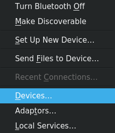
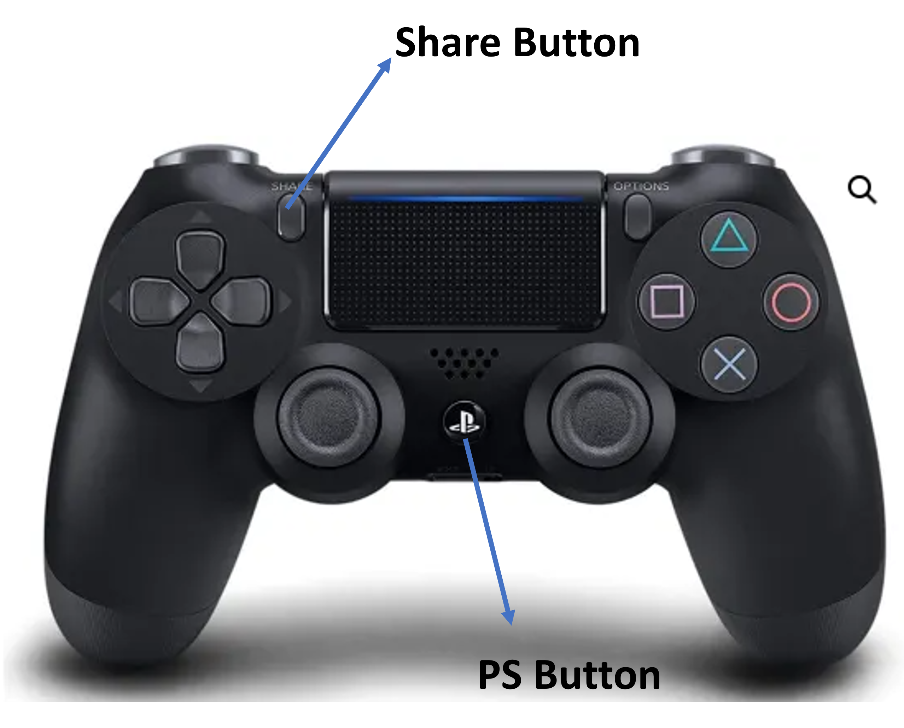
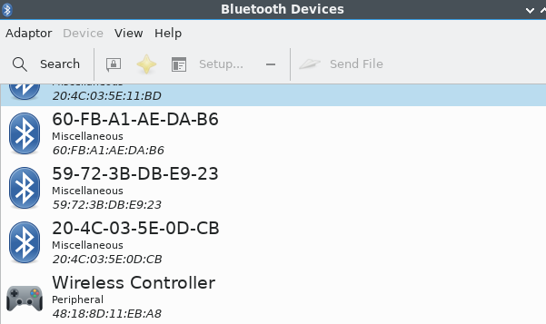
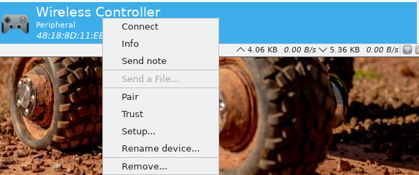
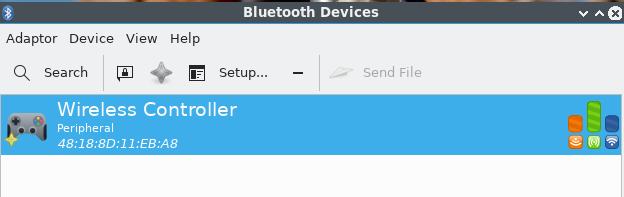
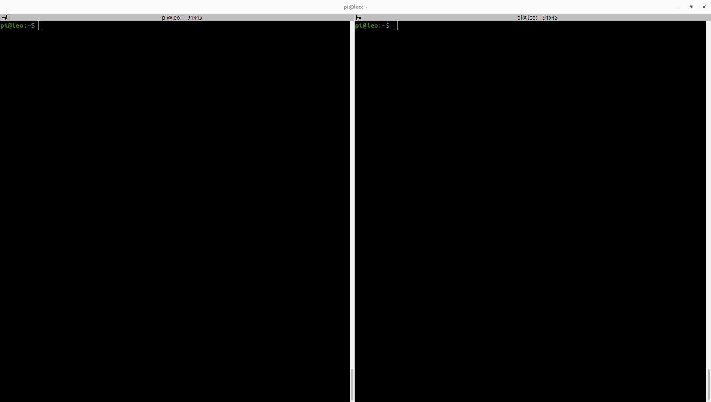
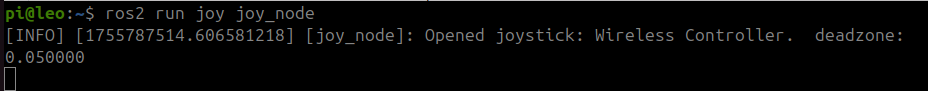
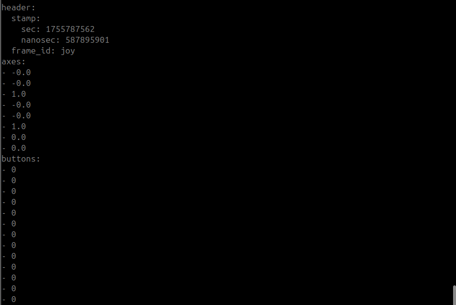
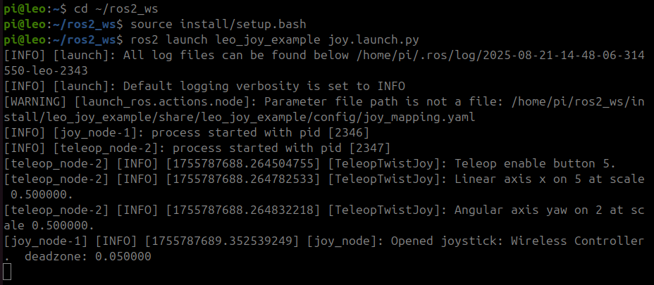

<h1 align="center"> Steering with Joystick </h1>

This section is dedicated to controlling LeoRover using a PS4 controller. In the previous section, you created a workspace and a package to move the robot using ROS2 topics. In this section, you will create a new package to move the robot using ROS2 and a joystick (PS4). After successfully completing this section, you will be able to control your robot using a PS4 controller.

**Important Note: Please use Remote Desktop Connection instead of PuTTY, as you will need to create multiple terminal windows.**


## Step 1: Creating ROS2 Workspace ##

First, create a new package
```
cd ~/ros2_ws/src
ros2 pkg create leo_joy_example --build-type ament_python --dependencies joy teleop_twist_joy
```

Update workspace

```
cd ~/ros2_ws
rosdep update
rosdep install --from-paths src -i
```

Create launch folder

```
cd src/leo_joy_example
mkdir launch
```

Create launch file

```
cd launch
nano joy.launch.py
```

Copy the following code into `joy.launch.py` file:

```python
from launch import LaunchDescription
from launch_ros.actions import Node
from ament_index_python.packages import get_package_share_directory
import os

def generate_launch_description():
    ld = LaunchDescription()

    package_name = 'leo_joy_example'
    joy_config_path = os.path.join(
        get_package_share_directory(package_name),
        'config',
        'joy_mapping.yaml'
    )

    # Joy node
    joy_node = Node(
        package='joy',
        executable='joy_node',
        name='joy_node',
        output='screen',
        parameters=[{
            'dev': '/dev/input/js0',
            'coalesce_interval': 0.02,
            'autorepeat_rate': 30.0
        }]
    )

    # Teleop node
    teleop_node = Node(
        package='teleop_twist_joy',
        executable='teleop_node',
        name='teleop_node',
        output='screen',
        parameters=[joy_config_path],
        remappings=[('cmd_vel', 'cmd_vel')]
    )

    # Add nodes to the launch description
    ld.add_action(joy_node)
    ld.add_action(teleop_node)

    return ld

```
press **Ctrl+O** , **Enter**, **Ctrl+X**

Modify your `setup.py` file at `~/ros2_ws/src/leo_joy_example`:
```python
from setuptools import find_packages, setup
import os
from glob import glob

package_name = 'leo_joy_example'

setup(
    name=package_name,
    version='0.0.0',
    packages=find_packages(exclude=['test']),
    data_files=[
        ('share/ament_index/resource_index/packages',
            ['resource/' + package_name]),
        ('share/' + package_name, ['package.xml']),
        (os.path.join('share', package_name, 'launch'), glob(os.path.join('launch', '*launch.[pxy][yma]*'))),
    ],
    install_requires=['setuptools'],
    zip_safe=True,
    maintainer='pi',
    maintainer_email='pi@todo.todo',
    description='TODO: Package description',
    license='TODO: License declaration',
    tests_require=['pytest'],
    entry_points={
        'console_scripts': [
        ],
    },
)


```

Create configuration folder
```
cd ~/ros2_ws/src/leo_joy_example
mkdir config
```

Create configuration file
```
cd config
nano joy_mapping.yaml
```

Copy the following configurations into  **joy_mapping.yaml** file:

```
axis_linear: 1
scale_linear: 0.4
axis_angular: 3
scale_angular: 2.0
enable_button: 5
```
press **Ctrl+o** , **Enter**, **Ctrl+x**

Finally, build the workspace

```
cd ~/ros2_ws
colcon build
```

## Step 2: Bluetooth Connection ##

To establish a Bluetooth connection between the PS4 controller and the Raspberry Pi, right-click on the Bluetooth icon in the bottom right corner and click **Devices**.

<p align="center">
  
</p>

Press the PS and Share buttons on the PS4 controller simultaneously until the LED starts blinking. See the buttons below:

<p align="center">
  
</p>

Then search for devices. It will find <b>Wireless Controller</b>.

<p align="center">
  
</p>

Right click on <b>Wireless Device</b>, click <b>Pair</b> and <b>Trust</b> in order.

<p align="center">
  
</p>

When your controller's LED stops blinking and becomes a stable colour, it is connected to the Raspberry Pi and added as a trusted device. Now you should see the following:

<p align="center">
  
</p>

Disconnect the controller and reconnect it, it should push a notification to connect, once this is done, the controller LED should turn blue.

## Step 3: Running ROS2 Nodes ##

First, open two terminal windows and source the workspace in both terminals.
```
cd ~/ros2_ws
```
<p align="center">
  
</p>

Type the following command in one of the terminals to run the ROS joystick node `joy_node`:

```
ros2 run joy joy_node
```

<p align="center">
  
</p>

Now, listen to the **/joy** topic in the second terminal:

```
ros2 topic echo /joy
```

You will notice that as you press buttons on your controller, data will be published via **/joy** as follows:

<p align="center">
  
</p>

First, investigate the relationship between buttons and axes. Then, check the configuration file **joy_mapping.yaml** that you created earlier to understand the functions of the PS4 buttons.

Now, launch the package that you created in the previous steps to control the LeoRover:

```
ros2 launch leo_joy_example joy.launch.py
```

<p align="center">
  
</p>

You can open the camera broadcast on your computer to monitor your robot while driving by connecting to **10.0.0.1** via your browser.
