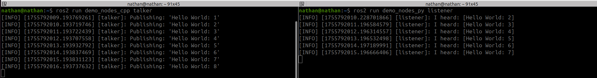

<h1 align="center"> Setting Up Intel NUC </h1>
Before you can start using the Intel NUC computer, you need to install the operating system (Ubuntu 24.04) and ROS2 Jazzy. This section will guide you through the installation of the required software.

---
<h2 align="center">Step 1: Burning the Ubuntu 24.04 Image into a USB Drive</h2>

First, you need to download the Ubuntu 24.04 OS image to your computer from
https://ubuntu.com/download/desktop

After downloading, you need to follow the same steps as burning the LeoROS image onto the SD Card. First, open the Etcher application, select the downloaded Ubuntu 24.04 image, choose the USB device, and finally, click on Flash. This process can take around 10 minutes.

---
<h2 align="center">Step 2: Installing Ubuntu 24.04 on the NUC</h2>

Plug in the USB with Ubuntu 24.04 into one of the USB ports of the Intel NUC and turn it on.

During the initial power on, ensure you hold down F10.  This will bring up the bios boot menu, select the USB stick.  If you see the operating system begin to start, you have missed the window to change boot media, restart the NUC and try again.

Then, you can follow the steps provided https://ubuntu.com/tutorials/install-ubuntu-desktop#5-installation-setup

---
<h2 align="center">Step 3: Installing ROS2 Jazzy on the NUC</h2>

### Set Locale ###
```
locale  # check for UTF-8

sudo apt update && sudo apt install locales
sudo locale-gen en_US en_US.UTF-8
sudo update-locale LC_ALL=en_US.UTF-8 LANG=en_US.UTF-8
export LANG=en_US.UTF-8

locale  # verify settings
```
### Setup Sources ###

```
sudo apt install software-properties-common
sudo add-apt-repository universe
```

```
sudo apt update && sudo apt install curl -y
export ROS_APT_SOURCE_VERSION=$(curl -s https://api.github.com/repos/ros-infrastructure/ros-apt-source/releases/latest | grep -F "tag_name" | awk -F\" '{print $4}')
```

```
curl -L -o /tmp/ros2-apt-source.deb "https://github.com/ros-infrastructure/ros-apt-source/releases/download/${ROS_APT_SOURCE_VERSION}/ros2-apt-source_${ROS_APT_SOURCE_VERSION}.$(. /etc/os-release && echo $VERSION_CODENAME)_all.deb" # If using Ubuntu derivates use $UBUNTU_CODENAME
sudo dpkg -i /tmp/ros2-apt-source.deb
```
### Install ROS 2 packages ###

```
sudo apt update
```
```
sudo apt upgrade
```
```
sudo apt install ros-jazzy-desktop
```
```
sudo apt install ros-dev-tools
```

To test your installation, please open two terminal windows and source your ROS2 workspace in both of them:

```
source /opt/ros/jazzy/setup.bash
```

In one of the terminals, run a data publisher node:
```
ros2 run demo_nodes_cpp talker
```
In the other terminal, run a data listener node:

```
ros2 run demo_nodes_py listener
```

You should see the following output:



To automatically source the ROS2 workspace, you can use the following commands:
```
echo "source /opt/ros/jazzy/setup.bash" >> ~/.bashrc
```

```
source ~/.bashrc
```

---
<h2 align="center">Step 4: Connecting NUC with LeoRover</h2>

You are provided with an Ethernet cable to establish a connection between LeoRover and the Intel NUC. After connecting them, you can observe topics published by LeoRover and send velocity commands to the robot from the NUC. Just as you did inside LeoRover, try sending velocity commands from the NUC's terminal.

```bash
ros2 topic pub /cmd_vel geometry_msgs/msg/Twist "{linear: {x: 0.1, y: 0.0, z: 0.0}, angular: {x: 0.0, y: 0.0, z: 0.0}}"
```

**Pro Tip: At a later stage of your project, you might want to look into setting up a hotspot service from you NUC to your personal laptops.**
