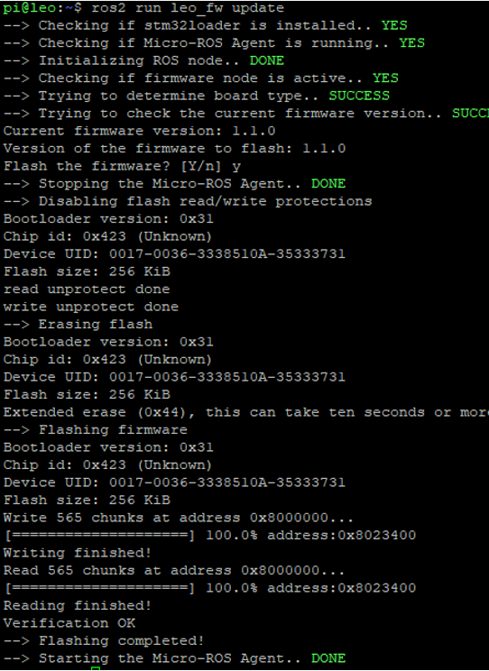
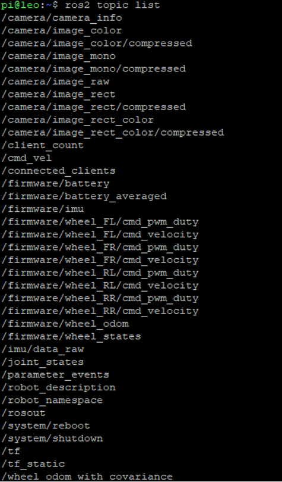
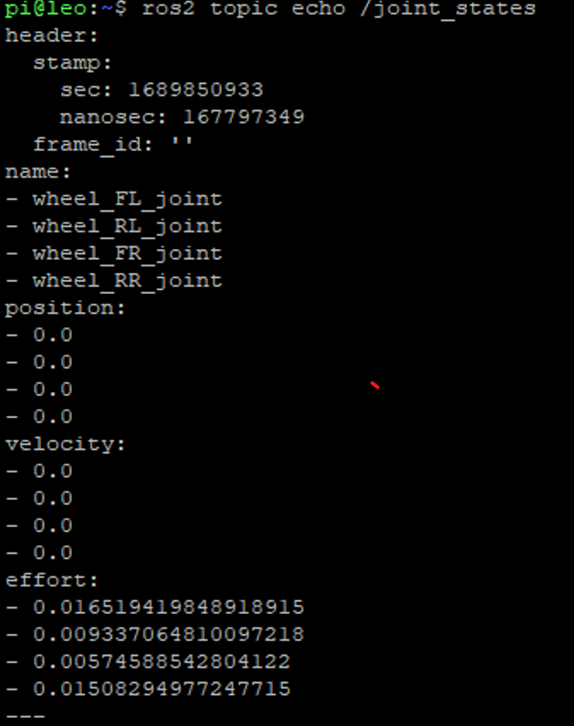
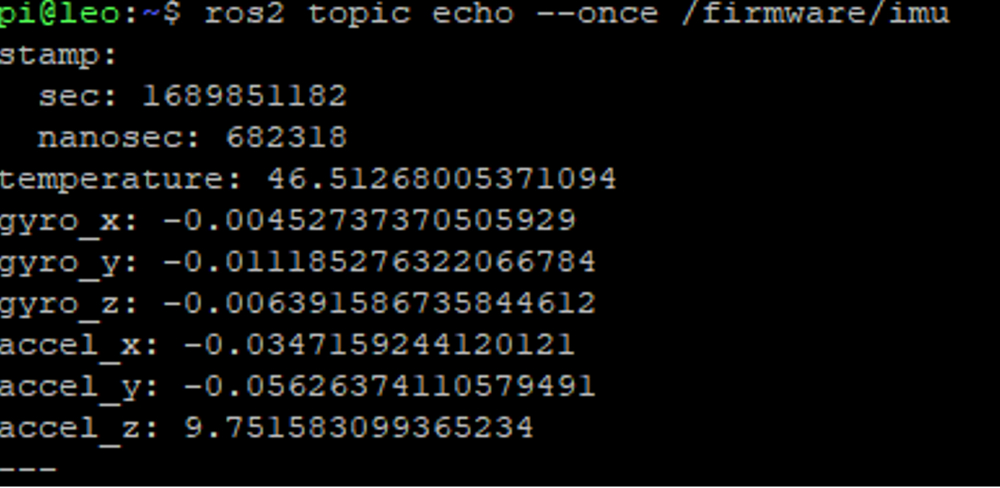
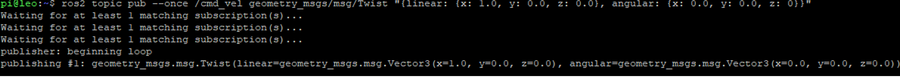

<h1 align="center"> LeoOS for ROS2 </h1>

So far, you have been using LeoOS (Ubuntu 20.04) and ROS Noetic version. Now, you will burn a new OS image into the Raspberry Pi, which has Ubuntu 22.04 and ROS2 Humble. In this step, you will follow a similar process to what you did in the Software Installation step. [Sofware Installation](../Task2_Robot_Software/LeoOS_and_Remote_Connection.md).

## Step 1: Download New LeoOS Image ##

You can dowload new image from https://github.com/LeoRover/LeoOS-ros2/releases

Please download the latest **full** version.

## Step 2: Burning New OS Image into SD Card ##

Remove the SD card from LeoRover using the plastic tool that you used to insert the card when you first installed the LeoOS. Afterward, follow the same steps as you did before: first, select your new OS image, then your USB port, and finally, select flash. This process takes around 5 minutes.

## Step 3: Turning On LeoRover ##

Insert the SD card into the Raspberry Pi and turn on LeoRover. The power LED will blink, and after around 30 seconds, you will see the Wi-Fi network of the LeoRover. The password for the network is the same as before: **password**.

## Step 4: Connecting LeoRover and Changing Wifi Network ID ##

You can connect to the LeoRover using PuTTY by entering the robot's IP, which is the same as before. After connecting to your robot, you should change the ID of the Wi-Fi network, as you have already done before in [Sofware Installation](../Task2_Robot_Software/LeoOS_and_Remote_Connection.md).

## Step 5: Connecting the Internet ##

The connection section is the same as the previous one.

**Note:** Do not use **sudo apt update** and **sudo apt upgrade** commands, as they may cause problems in the current version of LeoOS.

## Step 6: Update Robot Firmware ##

As you are now using ROS2, the firmware update command is slightly different:

```
ros2 run leo_fw update
```


## Step 7: Publishing and Listening ROS2 Topics ##

Now you should be able to publish and listen to robot-related ROS2 topics, similar to ROS1. To list all published topics:

```
ros2 topic list
```



You can listen to **joint_states**:

```
ros2 topic echo /joint_states
```


or imu data **firmware/imu**:
```
ros2 topic echo /firmware/imu
```



You can also send linear and angular velocities to the robot using the **cmd_vel** topic. For example, to send a forward velocity of 1 m/s for once,

```
ros2 topic pub --once /cmd_vel geometry_msgs/msg/Twist "{linear: {x: 1.0, y: 0.0, z: 0.0}, angular: {x: 0.0, y: 0.0, z: 0}}"
```



Alternatively, you can send it at a certain frequency.

```
ros2 topic pub –-rate 1 /cmd_vel geometry_msgs/msg/Twist "{linear: {x: 0.2, y: 0.0, z: 0.0}, angular: {x: 0.0, y: 0.0, z: 0}}"
```
where the rate defines the frequency, which is 1 Hz in the example.


