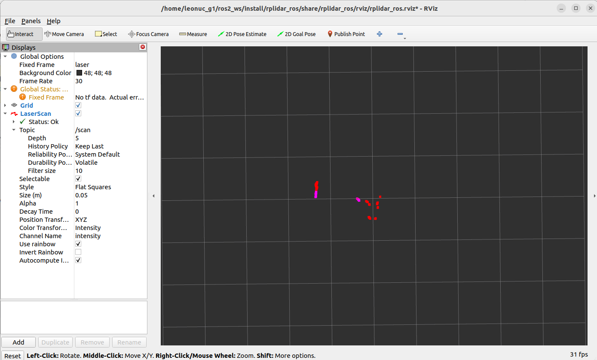

<h1 align="center"> Using RPLidar with ROS2 </h1>
This section is dedicated to the installation and usage of RPLidar on your NUC. Once you complete this section, you will be able to visualize RPLidar data with Rviz.

---

<h2 align="center">Step 1: Creating a ROS2 Workspace and Building the Lidar Package</h2>
Create ros_ws

```
mkdir -p ~/ros2_ws/src
cd ~/ros2_ws/src
```
Clone lidar repo

```
git clone -b ros2 https://github.com/Slamtec/rplidar_ros.git
```

Build lidar package

```
cd ..
colcon build --symlink-install
```

---

<h2 align="center">Step 2: Sourcing Local Workspace</h2>
Source local environment

```
source ./install/setup.bash
```

---

<h2 align="center">Step 3: Adding Udev Rules for RPLidar</h2>
Create udev rules for rplidar

```
sudo chmod 777 /dev/ttyUSB0
```
```
cd src/rplidar_ros/
source scripts/create_udev_rules.sh
```

---

<h2 align="center">Step 4: Launching RPLidar Node and Visualizing Data with Rviz</h2>
Plug the lidar into a suitable USB port via the interface block.

Now, you can launch the lidar node by

```
ros2 launch rplidar_ros view_rplidar_a2m12_launch.py
```
You should see the following Rviz screen. Move the lidar to see how it updates the measurements in Rviz.

<p align="center">
    
</p>
