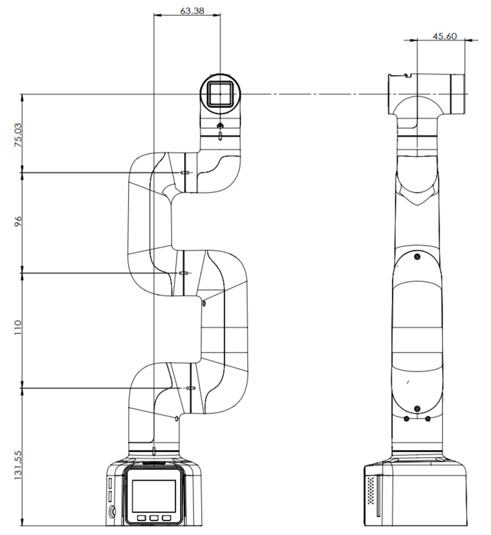
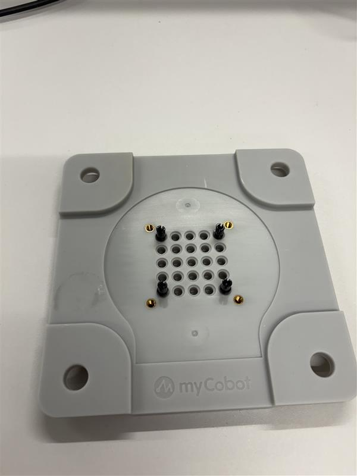
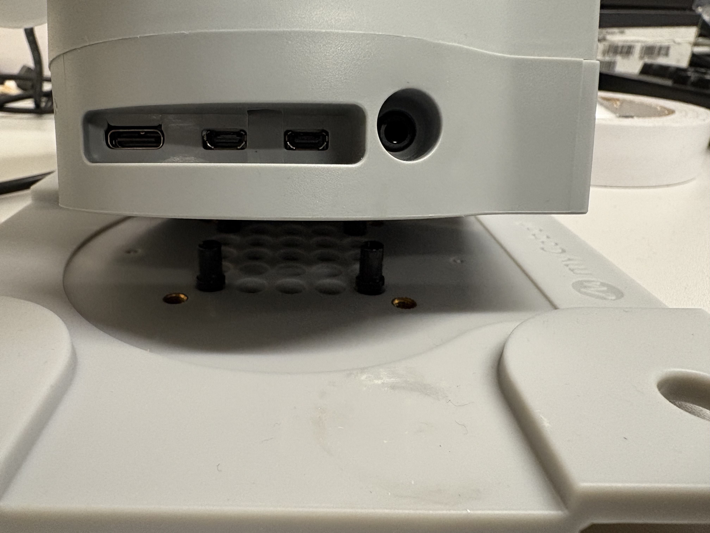
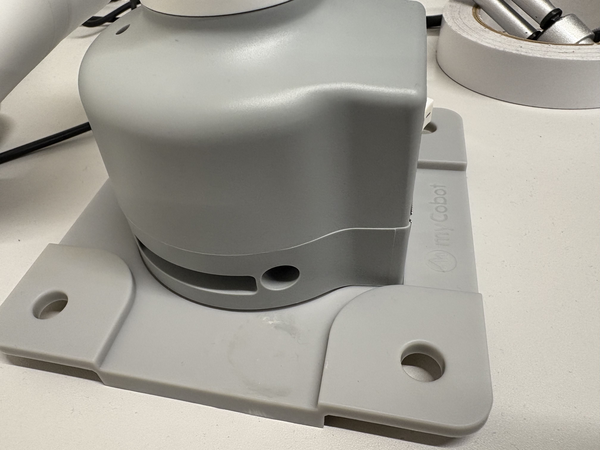
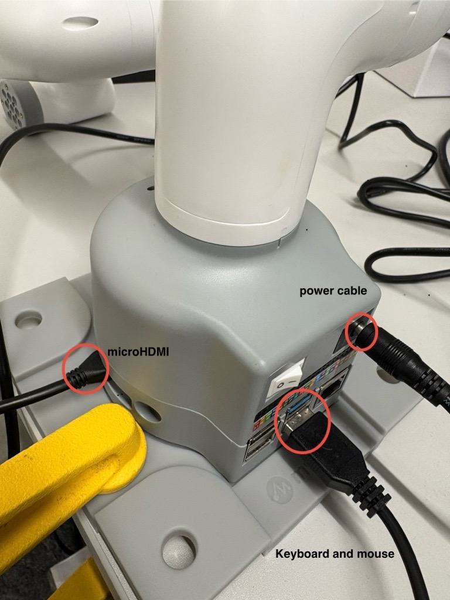
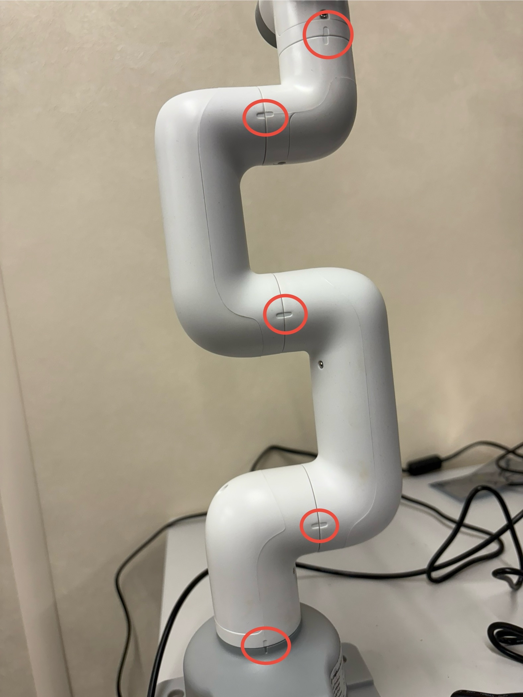

# myCobot 280 Pi Documentation

> [!CAUTION]
> If you are looking for the first iteration for this documentation that uses Galatic and Humble please '[click here](https://github.com/UoMMScRobotics/MSc-manipulator-task)' to be redirected.
>

## Table of Contents
1. [Key Specifications](#key-specifications)
2. [Performance & Structural Parameters](#performance--structural-parameters)
3. [Electronic Parameters & Interfaces](#electronic-parameters--interfaces)
4. [Kinematic Modeling (DH Parameters)](#kinematic-modeling-dh-parameters)
5. [Technical Diagram](#technical-diagram)
6. [Setup Guide](#setup-guide)
   - [Unboxing & Assembly](#unboxing--assembly)
   - [First Boot Steps](#first-boot-steps)
7. [Troubleshooting](#troubleshooting)
8. [Recommended next steps](#recommended-next-steps)

---

## Key Specifications

The **myCobot 280 Pi 2023** is a lightweight 6DOF manipulator with an in-built Raspberry Pi for communication and running ROS2 nodes.

<p align="center">
  <a href="http://www.youtube.com/watch?v=sY7ScSSkyfU" title="Video Title">
    
  </a>
</p>


## Performance & Structural Parameters

- **Model:** myCobot 280 Raspberry Pi
- **Operating System:** Ubuntu Mate 20.04
- **Microprocessor:** Raspberry Pi 4B (1.5GHz quad-core)
- **Degrees of Freedom:** 6
- **Payload:** 250g
- **Effective Working Radius:** 280mm
- **Net Weight:** 860g
- **Repeated Positioning Precision:** ±0.5mm
- **Communication:** Type-C
- **Joint Angles:** Joints J1-J5: -165° to +165°, J6: -175° to +175°
- **Power:** 12V, 5A DC charger

---

## Electronic Parameters & Interfaces

- **System on Chip (SOC):** Broadcom BCM2711
- **CPU:** 64-bit 1.5GHz quad-core
- **USB:** 2x USB3.0, 2x USB2.0
- **HDMI:** 2x microHDMI interfaces (port 2 recommended)
- **Connectivity:** Bluetooth, wireless, Ethernet
- **Pedestal Ports:**
  - **Front:** Power Switch, GPIO Pins, USB ports, DC power, Ethernet
  - **Side:** SD card slot, Type C, HDMI
- **End-effector Interfaces:**
  - Servo Interface for grippers
  - Grove Interface (GND, 5V, G26, G32)
  - Functional Interface Group 2 (5V, GND, 3.3V, G22, G19, G23, G33)
  - Type C for PC communication/firmware updates
  - **Atom:** 5x5 RGB LED (G27), key function (G39)

---

## Kinematic Modeling (DH Parameters)

The robot arm uses standard DH parameters for kinematic modeling:

| Joint (j) | theta | d (mm) | a (mm) | alpha (rad) | offset (rad) |
| :-------- | :---- | :----- | :----- | :---------- | :----------- |
| 1         | q1    | 131.22 | 0      | 1.5708      | 0            |
| 2         | q2    | 0      | -110.4 | 0           | -1.5708      |
| 3         | q3    | 0      | -96    | 0           | 0            |
| 4         | q4    | 63.4   | 0      | 1.5708      | -1.5708      |
| 5         | q5    | 75.05  | 0      | -1.5708     | 1.5708       |
| 6         | q6    | 45.6   | 0      | 0           | 0            |

---

## Technical Diagram

<p align="center">
  
</p>

---

## Setup Guide

### Flash the SD Card

As shared on MS Teams, download the `.img` file. Remove the SD card from the base of the manipulator.

We will use the build in Disks utility to flash the image onto the SD card.

<p align="center">
    
</p>
<p align="center">
    
</p>
<p align="center">
    
</p>

Once the SD card is flashed re-insert back into the manipulator. 

> [!IMPORTANT]
> Downloading and flashing the image can take a long time. Why not reach the Understanding and [Troubleshooting ROS 2 Networking and Communication Guide](https://github.com/UoMMScRobotics/UOMDocumentationForLeoRover/blob/main/Further_reading/Networking.md) while you wait?

### Unboxing & Assembly

1. **Base Plate Preparation:**  
   Place four clips in the corners of the base plate as shown.  
   <p align="center">
     
   </p>

2. **Mount Manipulator:**  
   Mount the manipulator on the base plate. Hold the manipulator during this process; the base plate alone cannot support its weight. Listen for a "click" when mounted.  
   <p align="center">
     
     
   </p>

3. **Fix to Surface:**  
   Clamp or use the suction pads, to steady the manipulator to the table before operation.  
   <p align="center">
     
   </p>

4. **Connect Peripherals:**  
   For the first boot, connect a keyboard, mouse, ethernet cable and microHDMI cable.
   <p align="center">
     
   </p>

5. **Power On:**  
   Ensure markings are aligned, then power on the robot. The servos will activate after a few seconds.  
   <p align="center">
     
   </p>

---

### First Boot Steps

This tutorial sets up a basic peer to peer wired network between the pi and another device (such as your NUC or laptop). This is to get you going, you will need to revise this set up when you consider your system architecture.

> [!WARNING]
> If previously you've set up up static IP addresses using `99-wired-static.yaml` then remove it using `sudo rm /etc/netplan/99-wired-static.yaml`, then `sudo netplan apply` to apply the change.

The pi will boot into the default user `elephant` which uses the password `trunk`. The pi has a static IP address, `10.3.14.59` (a little π humour).

Check the network on the pi, it should be set up as below.
<p align="center">
    
</p>
<p align="center">
    
</p>

**ROS2 Environment Setup on the pi:**  
We can automate sourcing our ROS workspace by appending instructions to **the end of** the `.bashrc` script.

 ```
 nano ~/.bashrc
 ```
 Scorll down to the bottom of the file and add:
 Ensure you replace `YOUR_GROUP_NUMBER' with an int value.
 ```bash
 # Source ROS Jazzy setup with error checking
if source /opt/ros/jazzy/setup.bash; then
  echo "Sourced /opt/ros/jazzy/setup.bash successfully"
else
  echo "Failed to source /opt/ros/jazzy/setup.bash"
fi

# Explicit setting of DDS
export RMW_IMPLEMENTATION=rmw_fastrtps_cpp
echo "DDS set to $RMW_IMPLEMENTATION"

# Source your workspace setup with error checking
if source ~/colcon_ws/install/setup.bash; then
  echo "Sourced ~/colcon_ws/install/setup.bash successfully"
else
  echo "Failed to source ~/colcon_ws/install/setup.bash"
fi

# Export and print ROS_DOMAIN_ID
export ROS_DOMAIN_ID=YOUR_GROUP_NUMBER
echo "ROS_DOMAIN_ID is set to $ROS_DOMAIN_ID"

# ROS_LOCALHOST_ONLY is being fazed out but is good for a quick set up
export ROS_LOCALHOST_ONLY=0
echo "ROS_LOCALHOST_ONLY is set to $ROS_LOCALHOST_ONLY"

echo "To change this automation, use nano to edit ~/.bashrc and the source ~/.bashrc to apply."
 ```
 Exit nano (CTRL+X) and save.

 After saving, apply the changes by running:
 ```bash
 source ~/.bashrc
 ```

**Test Servos:**  
 Launch the slider test:
 ```bash
 ros2 launch mycobot_280pi slider_control.launch.py
 ```
> [!WARNING]
> Avoid using the `Randomize` button. This interface does not contrain the manipulator. Random joint configurations may cause the arm to attempt to move through the table or other objects.
---


**Laptop/NUC setup**  

> [!WARNING]
> If previously you've set up up static IP addresses using `99-wired-static.yaml` then remove it using `sudo rm /etc/netplan/99-wired-static.yaml`, then `sudo netplan apply` to apply the change.
> 
Now let's set up your laptop/NUC for our peer to peer wired network. Ensure you have ROS Jazzy installed on the device and you have the ethernet cable plugged into both your device and the raspberry pi. 
Again we can automate sourcing our ROS workspace by appending instructions to **the end of** the `.bashrc` script.
Ensure you replace `YOUR_GROUP_NUMBER' with an int value.
```
# Source ROS Jazzy setup with error checking
if source /opt/ros/jazzy/setup.bash; then
  echo "Sourced /opt/ros/jazzy/setup.bash successfully"
else
  echo "Failed to source /opt/ros/jazzy/setup.bash"
fi

# Delcare the DDS
export RMW_IMPLEMENTATION=rmw_fastrtps_cpp
echo "Explicilty set fast DDS"


# Export and print ROS_DOMAIN_ID
export ROS_DOMAIN_ID=10
echo "ROS_DOMAIN_ID is set to $ROS_DOMAIN_ID"
echo "To change this automation, use nano to edit ~/.bashrc and the source ~/.bashrc to apply."

# For quick setup use ROS_LOCALHOST_ONLY, do revise later
export ROS_LOCALHOST_ONLY=0
echo "ROS_LOCALHOST_ONLY set to $ROS_LOCALHOST_ONLY"
```
 Exit nano (CTRL+X) and save.

 After saving, apply the changes by running:
 ```bash
 source ~/.bashrc
 ```

**Test the set up**

On the raspberry pi run: `ros2 launch mycobot_280pi slider_control.launch.py`. Leave that running and turn your attention to your other device and run: `ros2 topic list`. You should be able to see the topics running on your arm from your NUC/Laptop.

**Remote Access**

You are not required to use a monitor and pherierals everytime you want to use your raspberry pi. You can remove access the device, in this set up we use the static IP and can SSH.
```
ssh elephant@10.3.14.59
```
The password being `trunk`.
Any issues with SSH please see troubleshooting.

### Troubleshooting

Any issues with `known_hosts` try:
```
ssh-keygen -R 10.3.14.59
```

Any issues with hanging when trying to SSH, or Black GUI with Gazebo please the [Troubleshooting ROS 2 Networking and Communication Guide](https://github.com/UoMMScRobotics/UOMDocumentationForLeoRover/blob/main/Further_reading/Networking.md). 

### Recommended next steps

The world is your oyster! You do need to figure out how you're going to do everything else such as trajectories, motion planners, kinematics solvers, collision detection, etc. Using Move it would be an option, but others are available. And how the gripper works... And also consider the bigger networking plan beyond the peer to peer network covered in this tutorial. A lot to think about! 


