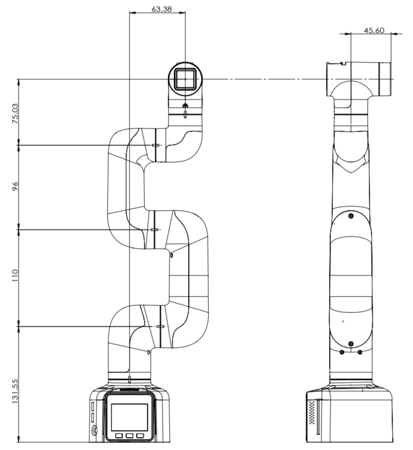
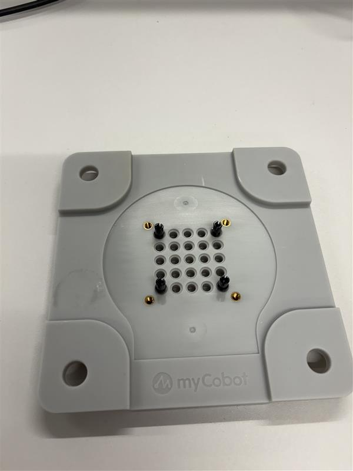
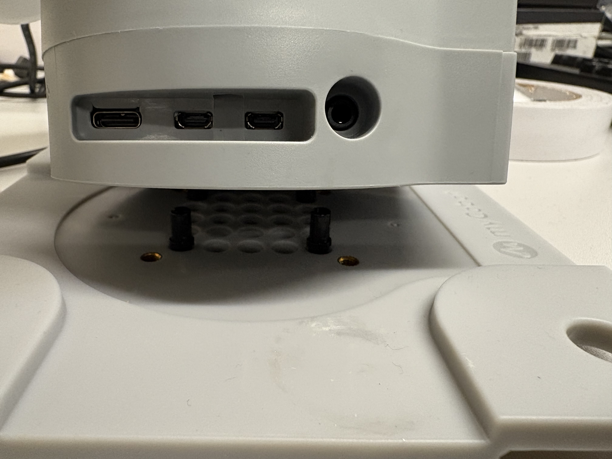
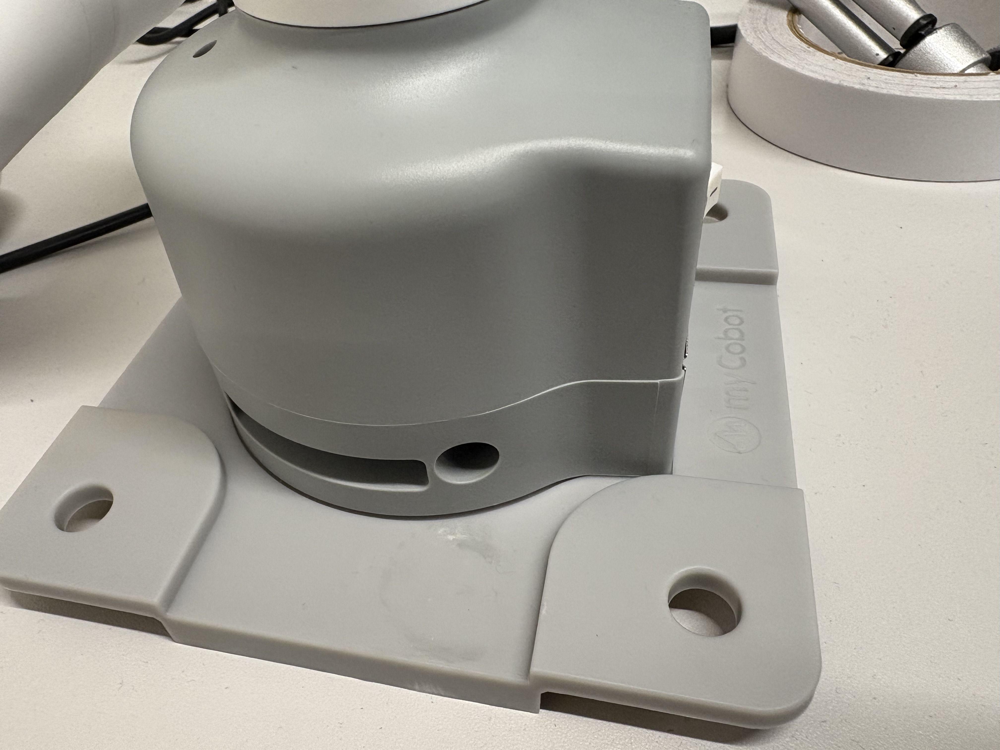
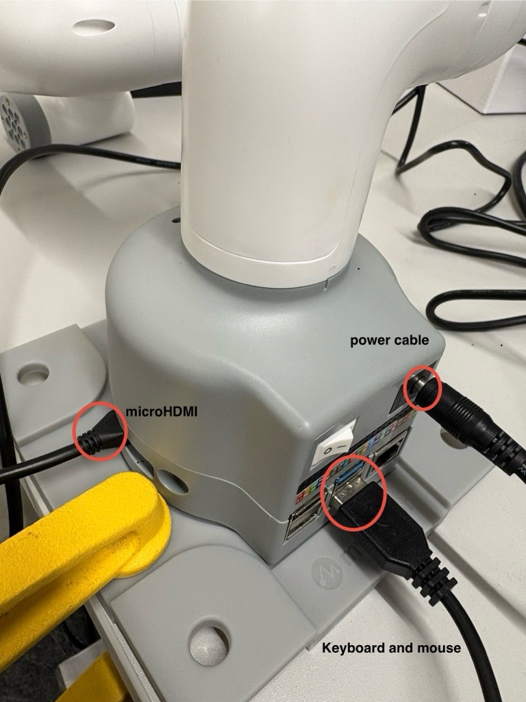
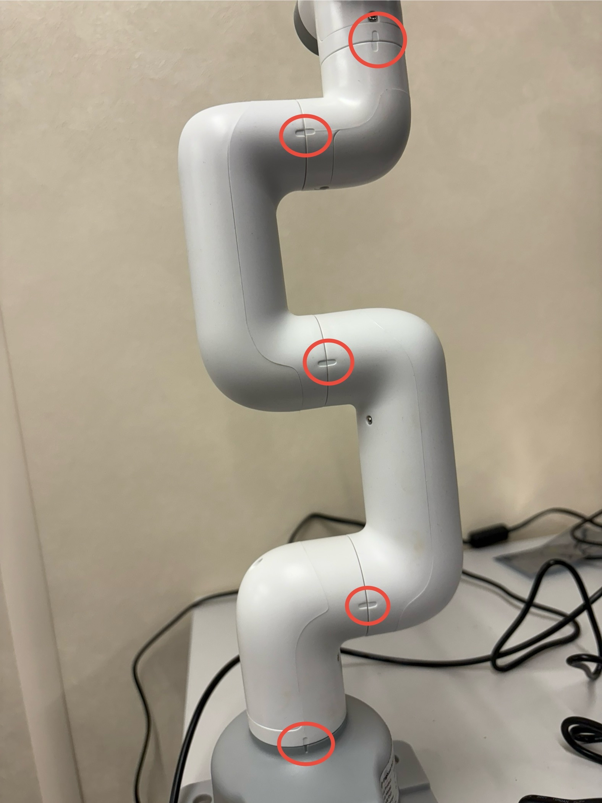

# myCobot 280 Pi Documentation

> [!CAUTION]
> If you are looking for the first iteration for this documentation that uses Galatic and Humble please '[click here](https://github.com/UoMMScRobotics/MSc-manipulator-task)' to be redirected.
>

## Table of Contents
1. [Key Specifications](#key-specifications)
2. [Performance & Structural Parameters](#performance--structural-parameters)
3. [Electronic Parameters & Interfaces](#electronic-parameters--interfaces)
4. [Kinematic Modeling (DH Parameters)](#kinematic-modeling-dh-parameters)
5. [Technical Diagram](#technical-diagram)
6. [Setup Guide](#setup-guide)
   - [Unboxing & Assembly](#unboxing--assembly)
   - [First Boot Steps](#first-boot-steps)
7. [Troubleshooting](#troubleshooting)
8. [Recommended next steps](#recommended-next-steps)

---

## Key Specifications

The **myCobot 280 Pi 2023** is a lightweight 6DOF manipulator with an in-built Raspberry Pi for communication and running ROS2 nodes.

<p align="center">
  <a href="http://www.youtube.com/watch?v=sY7ScSSkyfU" title="Video Title">
    
  </a>
</p>


## Performance & Structural Parameters

- **Model:** myCobot 280 Raspberry Pi
- **Microprocessor:** Raspberry Pi 4B (1.5GHz quad-core)
- **Degrees of Freedom:** 6
- **Payload:** 250g
- **Effective Working Radius:** 280mm
- **Net Weight:** 860g
- **Repeated Positioning Precision:** ±0.5mm
- **Communication:** Type-C
- **Joint Angles:** Joints J1-J5: -165° to +165°, J6: -175° to +175°
- **Power:** 12V, 5A DC charger

---

## Electronic Parameters & Interfaces

- **System on Chip (SOC):** Broadcom BCM2711
- **CPU:** 64-bit 1.5GHz quad-core
- **USB:** 2x USB3.0, 2x USB2.0
- **HDMI:** 2x microHDMI interfaces (port 2 recommended)
- **Connectivity:** Bluetooth, wireless, Ethernet
- **Pedestal Ports:**
  - **Front:** Power Switch, GPIO Pins, USB ports, DC power, Ethernet
  - **Side:** SD card slot, Type C, HDMI
- **End-effector Interfaces:**
  - Servo Interface for grippers
  - Grove Interface (GND, 5V, G26, G32)
  - Functional Interface Group 2 (5V, GND, 3.3V, G22, G19, G23, G33)
  - Type C for PC communication/firmware updates
  - **Atom:** 5x5 RGB LED (G27), key function (G39)

---

## Kinematic Modeling (DH Parameters)

The robot arm uses standard DH parameters for kinematic modeling:

| Joint (j) | theta | d (mm) | a (mm) | alpha (rad) | offset (rad) |
| :-------- | :---- | :----- | :----- | :---------- | :----------- |
| 1         | q1    | 131.22 | 0      | 1.5708      | 0            |
| 2         | q2    | 0      | -110.4 | 0           | -1.5708      |
| 3         | q3    | 0      | -96    | 0           | 0            |
| 4         | q4    | 63.4   | 0      | 1.5708      | -1.5708      |
| 5         | q5    | 75.05  | 0      | -1.5708     | 1.5708       |
| 6         | q6    | 45.6   | 0      | 0           | 0            |

---

## Technical Diagram

<p align="center">
  
</p>

---

## Setup Guide

### Flash the SD Card

As shared on MS Teams, download the `.img` file. Remove the SD card from the base of the manipulator.

We will use the build in Disks utility to flash the image onto the SD card.

<p align="center">
    
</p>
<p align="center">
    
</p>
<p align="center">
    
</p>

Once the SD card is flashed re-insert back into the manipulator. 

> [!IMPORTANT]
> Downloading and flashing the image can take a long time. Why not reach the Understanding and [Troubleshooting ROS 2 Networking and Communication Guide](https://github.com/UoMMScRobotics/UOMDocumentationForLeoRover/blob/main/Further_reading/Networking.md) while you wait?

### Unboxing & Assembly

1. **Base Plate Preparation:**  
   Place four clips in the corners of the base plate as shown.  
   <p align="center">
     
   </p>

2. **Mount Manipulator:**  
   Mount the manipulator on the base plate. Hold the manipulator during this process; the base plate alone cannot support its weight. Listen for a "click" when mounted.  
   <p align="center">
     
     
   </p>

3. **Fix to Surface:**  
   Clamp or use the suction pads, to steady the manipulator to the table before operation.  
   <p align="center">
     
   </p>

4. **Connect Peripherals:**  
   For the first boot, connect a keyboard, mouse, ethernet cable and microHDMI cable.
   <p align="center">
     
   </p>

5. **Power On:**  
   Ensure markings are aligned, then power on the robot. The servos will activate after a few seconds.  
   <p align="center">
     
   </p>

---

### First Boot Steps
## You will need a monitor and peripherals for the first time only.


This tutorial sets up a basic wired network between the pi and another device (such as your NUC or laptop). This is to get you going, you will need to revise this set up when you consider your system architecture.

Our aim is to set up:

```text
                 ROBOT MANIPULATOR
              Ubuntu 24.04 / ROS 2 Jazzy

Laptop                       Raspberry Pi
┌────────────────┐          ┌─────────────────┐
│ Ethernet       │          │ eth0            │
│ 10.3.14.60/24  │──────────│ 10.3.14.59/24  │
└────────────────┘          └─────────────────┘
                                    │
                              SSH 10.3.14.59

The pi will boot into the default user `elephant` which uses the password `trunk`. 

Let us set up the network

List all Netplan configuration:

```bash
ls -l /etc/netplan/
```

Then inspect **all** YAML files:

```bash
sudo cat /etc/netplan/*.yaml
```

This is important because Netplan reads configuration from multiple YAML files and merges them.

For example, we originally had:

```text
/etc/netplan/
├── 50-cloud-init.yaml
└── 90-NM-....yaml
```

One configuration said:

```yaml
dhcp4: true
```

while another assigned:

```yaml
addresses:
  - 10.3.14.59/24
```

That means two files were trying to describe the same `eth0` interface differently.

For an embedded robot, avoid this where possible. The Ethernet configuration should have **one clear source of truth**.

If there is an additional NetworkManager-generated Netplan file defining `eth0`, such as:

```text
90-NM-xxxxxxxx.yaml
```

and `50-cloud-init.yaml` is going to become the authoritative Ethernet configuration, remove the conflicting file:

```bash
sudo rm /etc/netplan/90-NM-xxxxxxxx.yaml
```

onfigure the static Ethernet address

Edit:

```bash
sudo nano /etc/netplan/50-cloud-init.yaml
```

Use:

```yaml
network:
  version: 2
  renderer: NetworkManager
  ethernets:
    eth0:
      addresses:
        - 10.3.14.59/24
      dhcp4: false
      dhcp6: false
```

Save and exit.

Prevent cloud-init rewriting networking

Because the configuration file is named `50-cloud-init.yaml`, prevent cloud-init from regenerating network configuration:

```bash
sudo mkdir -p /etc/cloud/cloud.cfg.d
```

Then:

```bash
echo 'network: {config: disabled}' | \
sudo tee /etc/cloud/cloud.cfg.d/99-disable-network-config.cfg
```

This does not disable cloud-init entirely. It prevents cloud-init from managing the network configuration.

validate

```bash
sudo netplan generate
```
```bash
sudo netplan apply
```
When we reboot the changes will persist 
```bash
sudo reboot
```

> [!NOTE]
> Before the reboot add steps so can remote access via VNC

Everytime the mycobot boots the ethernet port will have the IP address, `10.3.14.59` (a little π humour).

While we still have pheriphrals handy let's set up the **ROS2 Environment Setup on the pi:** 

We can automate sourcing our ROS workspace by appending instructions to **the end of** the `.bashrc` script.

 ```
 nano ~/.bashrc
 ```
 Scorll down to the bottom of the file and add:
 Ensure you replace `YOUR_GROUP_NUMBER' with an int value.
 ```bash
 # Source ROS Jazzy setup with error checking
if source /opt/ros/jazzy/setup.bash; then
  echo "Sourced /opt/ros/jazzy/setup.bash successfully"
else
  echo "Failed to source /opt/ros/jazzy/setup.bash"
fi

# Explicit setting of DDS
export RMW_IMPLEMENTATION=rmw_fastrtps_cpp
echo "DDS set to $RMW_IMPLEMENTATION"

# Source your workspace setup with error checking
if source ~/colcon_ws/install/setup.bash; then
  echo "Sourced ~/colcon_ws/install/setup.bash successfully"
else
  echo "Failed to source ~/colcon_ws/install/setup.bash"
fi

# Export and print ROS_DOMAIN_ID
export ROS_DOMAIN_ID=YOUR_GROUP_NUMBER
echo "ROS_DOMAIN_ID is set to $ROS_DOMAIN_ID"

echo "To change this automation, use nano to edit ~/.bashrc and the source ~/.bashrc to apply."
 ```
 Exit nano (CTRL+X) and save.

 After saving, apply the changes by running:
 ```bash
 source ~/.bashrc
 ```

**Test Servos:**  
 Launch the slider test:
 ```bash
 ros2 launch mycobot_280pi slider_control.launch.py
 ```
> [!WARNING]
> Do not use the `Randomize` button. This interface does not constrain the manipulator. Random joint configurations may cause the arm to attempt to move through the table or other objects.

Next we're going to set up our laptop or NUC so we next have to use a monitor or any extra peripherals when developing the mycobot.


**Laptop/NUC setup**  

Now let's set up your laptop/NUC for our peer to peer wired network. Ensure you have ROS Jazzy installed on the device and you have the ethernet cable plugged into both your device and the raspberry pi. 

Give the laptop's Ethernet interface a manual IPv4 configuration, so it's on the same subnet as the mycobott:

```text
IPv4 address:  10.3.14.60
Netmask:       255.255.255.0
Prefix:        /24
Gateway:       blank
DNS:           blank
```


Again we can automate sourcing our ROS workspace by appending instructions to **the end of** the `.bashrc` script.
Ensure you replace `YOUR_GROUP_NUMBER' with an int value.
```
# Source ROS Jazzy setup with error checking
if source /opt/ros/jazzy/setup.bash; then
  echo "Sourced /opt/ros/jazzy/setup.bash successfully"
else
  echo "Failed to source /opt/ros/jazzy/setup.bash"
fi

# Delcare the DDS
export RMW_IMPLEMENTATION=rmw_fastrtps_cpp
echo "Explicilty set fast DDS"


# Export and print ROS_DOMAIN_ID
export ROS_DOMAIN_ID=10
echo "ROS_DOMAIN_ID is set to $ROS_DOMAIN_ID"
echo "To change this automation, use nano to edit ~/.bashrc and the source ~/.bashrc to apply."

```
 Exit nano (CTRL+X) and save.

 After saving, apply the changes by running:
 ```bash
 source ~/.bashrc
 ```

**Test the set up**

On the raspberry pi run: `ros2 launch mycobot_280pi slider_control.launch.py` (you can perhaps automate any nodes launching with launch files and the bashrc). Leave that running and turn your attention to your other device and run: `ros2 topic list`. You should be able to see the topics running on your arm from your NUC/Laptop.

**Remote Access**

You are not required to use a monitor and pherierals everytime you want to use your raspberry pi. You can remove access the device, in this set up we use the static IP and can SSH.
```
ssh elephant@10.3.14.59
```
The password being `trunk`.
Any issues with SSH please see troubleshooting.


### Troubleshooting

* General check
   * In a multi system setup ensure the DDS is being used, check by running `ros2 doctor --report` on all machines

* Find out more with verbose 
   ```
   ssh -vvv elephant@10.3.14.59
   ```
* Issues with GUI applications, enable X11 forwarding.
   ```
   ssh -X elephant@10.3.14.59
   ```
* Issues with `known_hosts` try:
   ```
   ssh-keygen -R 10.3.14.59
   ```
* Check the device you're trying to SSH from has the SSH client
   ```
   ssh -V
    ```
   If needed
   ```
   sudo apt install openssh-client 
   ```

* Check the device you're trying to SSH into has the SSH server
   ```
   # Check if the SSH server (sshd) service is running
   sudo systemctl status ssh
   
   # Start the SSH server immediately (if it's installed but not running)
   sudo systemctl start ssh
   
   # Enable the SSH server to start automatically at boot
   sudo systemctl enable ssh
   
   # Install the OpenSSH server package (if it's not already installed)
   sudo apt update && sudo apt install -y openssh-server
   ```
* Issues with clocks out of sync
   * Give the device internet access with `nmtui` or other means, then check `timedatectl status`.
     
* Issues with hanging when trying to SSH, or Black GUI with Gazebo.
   * Please the [Troubleshooting ROS 2 Networking and Communication Guide](https://github.com/UoMMScRobotics/UOMDocumentationForLeoRover/blob/main/Further_reading/Networking.md), where it will explain the background context and provide a fix.


### Recommended next steps

The world is your oyster! Do not fall into doing nothing in the "abyss of unstructuredness"! 
Things you need to do that will take longer than you expect:
* How are you going to trajectories, motion planners, kinematics solvers, collision detection, etc. Using `MoveIt 2` is an option, but others are available.
* Have you used the gripper and considered how that needs to be set up?
* What is the bigger networking plan beyond connecting just the manipulator to your NUC or laptop?. How do you need to change/expand this network set up to cover your whole system?
   * If you haven't read [Troubleshooting ROS 2 Networking and Communication Guide](https://github.com/UoMMScRobotics/UOMDocumentationForLeoRover/blob/main/Further_reading/Networking.md) now might be a good time.
* Do you have a simulation setup so you can work on your project without having physical access to your robot?


