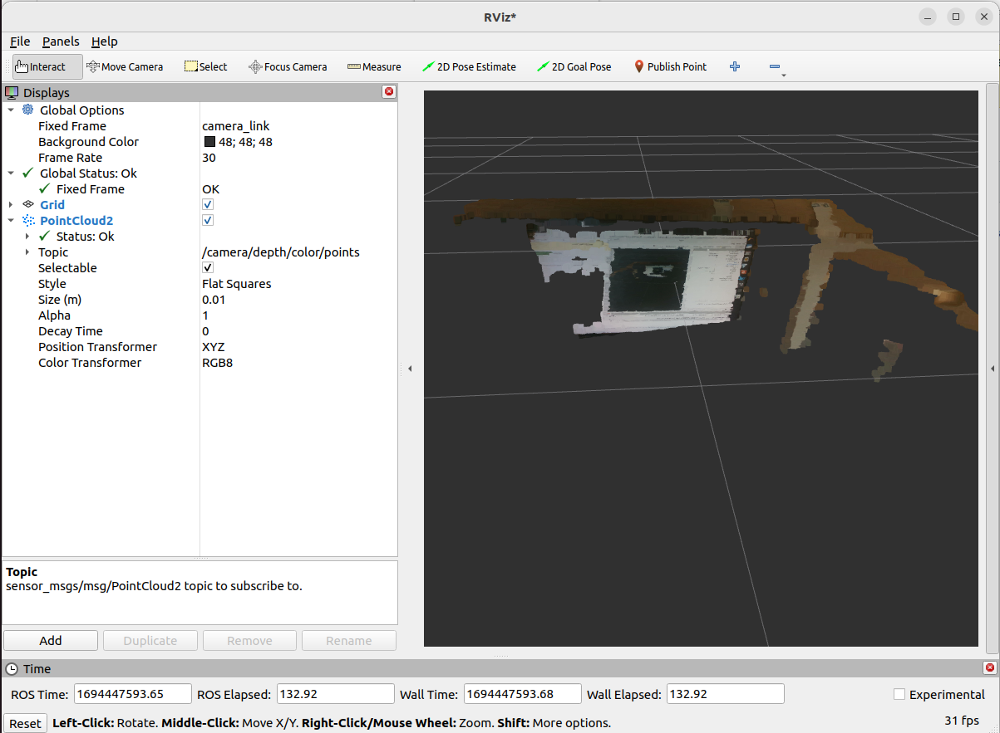

<h1 align="center"> Using Realsense with ROS2 </h1>
This section is dedicated to the installation and usage of Realsense Camera on your NUC. Once you complete this section, you will be able to visualize Depth and RGB data with Rviz and Realsense-Viewer.

## Step 1: Install latest Intel® RealSense™ SDK 2.0  ##

```
sudo apt install ros-humble-librealsense2*
```

## Step 2: Install debian package from ROS servers ##

```
sudo apt install ros-humble-realsense2-*
```
## Step 3: Run Realsense Camera Node and Visualize Data ##
Plug the Realsense RGBD camera into a **USB 3** port (blue colour plastic), using the provided USB A -> C cable.  If the Realsense is plugged into a USB 2.X port (black plastic), it will not report an error but the device will not work correctly.  If using a third party usb cable, this can cause connectivity issues if it is not of a high quality.  In general it is best to use the supplied cable.  


First, launch Realsense node and publish pointcloud data:

```
ros2 launch realsense2_camera rs_launch.py depth_module.profile:=1280x720x30 pointcloud.enable:=true
```

Open another terminal and launch Rviz:

```
rviz2 rviz
```
In Rviz, change **Fixed Frame** from **map** to **camera link** and add **PointCloud2** to display:


and select **/camera/depth/color/points** as the topic name:




