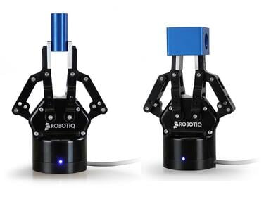
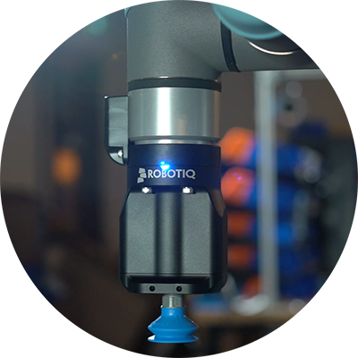
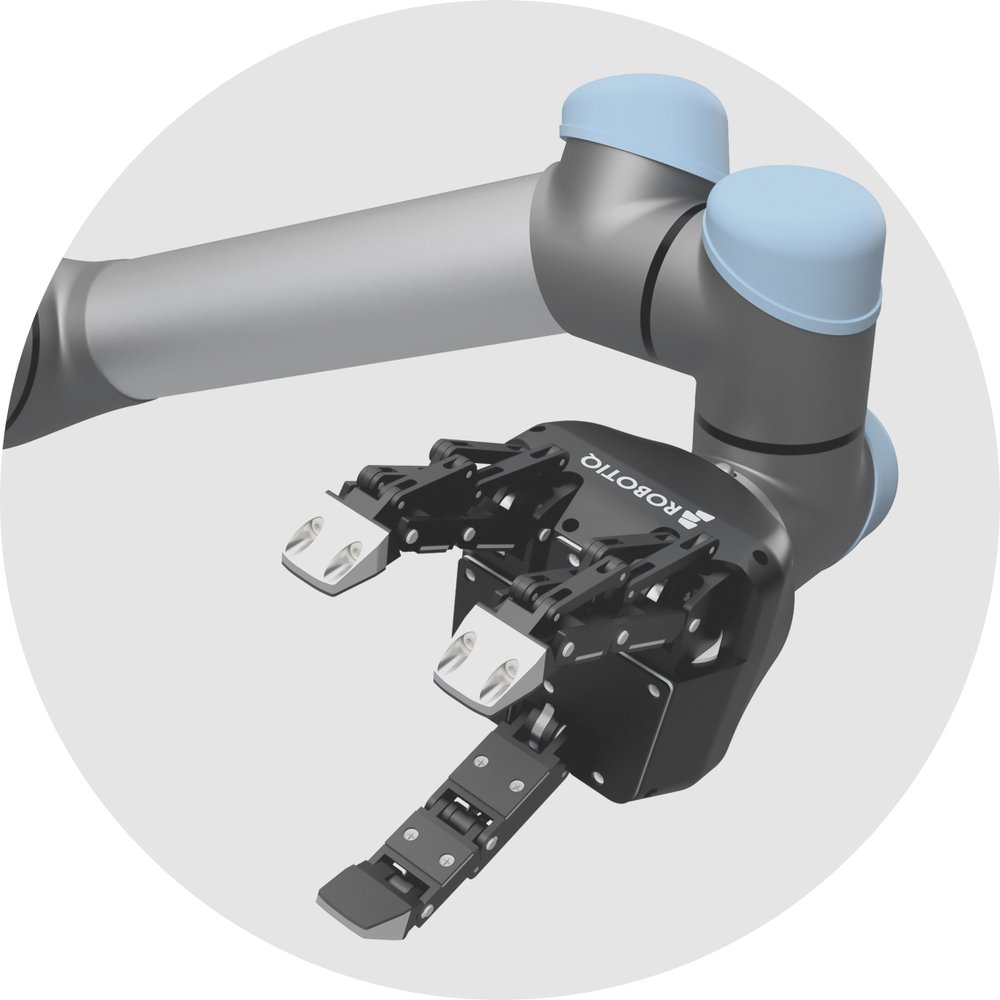

<h1 align="center"> Grasping </h1>

There are several considerations for grasping objects, such as End Effector Design, Grasp Generation, and Grasp Execution. Grasping generally happens in 2 steps: first, you calculate a grasp for your object and then use some control approach to execute the grasp. Depending on your application, a simple or complex approach can be used for each. Starting off with simple solutions can be beneficial to reduce complexity. Simulation software such [Gazebo](https://gazebosim.org/home) , [Coppeliasim](https://www.coppeliarobotics.com/) , or [GraspIt](https://graspit-simulator.github.io/) can be used to test your approach before testing in the real world.

**THESE ARE ONLY SUGGESTIONS OR SIGNPOSTING TO FURTHER RESOURCES, THE CHOICE OF APPROACH IS DOWN TO YOU**

## End Effector Design ##

There are many designs of rigid and compliant end effector designs, usually highly specialised for a particular task.  For example, a gripper designed for picking up fruit will likely be compliant and low force consisting of individual "fingers", compared to a vacuum suction end effector for picking up boxes with flat sides.  The mechanical design is a free choice, and should be informed by the tasks being undertaken.

The most common gripper design is the two-finger type, typically a parallel motion or simple "pinching" design.  Most commonly, two fingers move sympathetically so the object is centered within the jaws (see the image below of the Robotiq 2F series gripper). Another common design is the suction cup gripper and the three-finger gripper (image below). However, the gripper design is entirely open to customization.

## Grasping ##

Packages such as MoveIt have some built-in [grasping utilities](https://moveit.picknik.ai/humble/doc/tutorials/pick_and_place_with_moveit_task_constructor/pick_and_place_with_moveit_task_constructor.html) such as simple pick and place. These packages can do both the grasp generation and execution steps, but they may be limited in scope for your needs.
You can also separately calculate your grasp and then use MoveIt to control your robot to grasp the objects. 
### Grasp Generation ###
There are many approaches to generate grasp that you can use to grasp your objects.For simple objects, you may wish to just store a set of precalculate grasps for your objects, then execute one of the grasps at run time when you discover the object. The precalculated grasps can be estimated from physical experiments with your end effector or basic calculations or just hardcoded from your intuition. This approach works well for objects of known shape. You should be able to find books on this approach in the [Manchester library](https://www.librarysearch.manchester.ac.uk/discovery/search?search_scope=MyInst_and_CI&tab=Everything&pcAvailability=false&sortby=rank&vid=44MAN_INST:MU_NUI&mode=basic&userQuery=grasping&submit=Search&query=any,contains,grasping).  

If you would like to generate grasps at run time, depending on your choice of end effector design, you can use various techniques. Most state-of-the-art approaches use machine learning and, as a result, might be too computationally expensive for your applications. For parrel jaw grippers are a lot of libraries available you can use, for example, [GraspNetApi](https://github.com/graspnet/graspnetAPI) and [grasp_libaries_list](https://github.com/Po-Jen/awesome-grasping?tab=readme-ov-file). If you have a custom end effector design, you might be able to find approaches on [papers with code website](https://paperswithcode.com/task/robotic-grasping). As with object detection, be mindful of computing costs, as many of these approaches can use a lot of memory and computing. In many cases, simple solution might work better. 

### Grasp Execution ###

Once you have calculated your grasp, you can execute the grasp in your robot. You can use different control techniques depending on how you represent your grasp, such as pose control, position control, etc. For example [Move Group](https://ros-planning.github.io/moveit_tutorials/doc/move_group_python_interface/move_group_python_interface_tutorial.html#getting-started) in Moveit! It can be used to plan and execute the movements of your robot. There are also other control libraries and approaches you can use. Simple plans could be predefined, such as moving above the object and down to grasp the pose. You may wish to add a feedback loop to your control to account for real-world errors. This can be done using feedback from your available sensors, such as visual servoing from visual information. There are many examples available on Git Hub. 

### PincherX 150 Manipulator Arm ###

The documentation regarding the kinematic information, ROS/ROS2 interfaces, etc. could be found in the following link:

[Arm Documentation](https://docs.trossenrobotics.com/interbotix_xsarms_docs/)

The following github link includes all necessary ROS2 packages and instructions.:

[Arm Github Page](https://github.com/Interbotix/interbotix_ros_manipulators)

