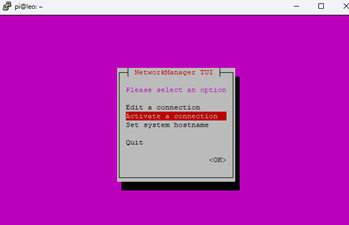
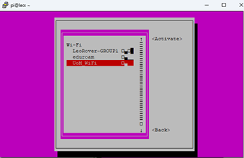
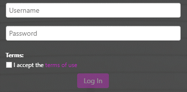
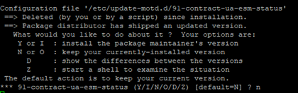
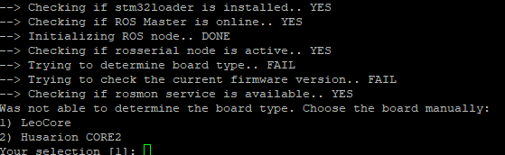
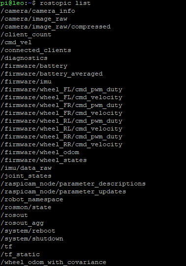
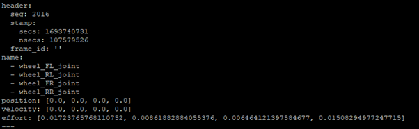

<h1 align="center"> Internet Connection and Updating The Robot Software </h1>

In this section, you will learn how to set up an internet connection via UoM Wifi and how to update your robot's software and firmware. Upon successful completion of this part, you will be able to drive your LeoRover using a browser-based user interface or ROS.

**Note:** You have seen two methods to connect to the Raspberry Pi (PuTTY and Remote Desktop Connection). You can use whichever method you prefer to enter the provided codes in the course documentation. Specifically, you can use either the PuTTY console or the terminal on the Raspberry Pi's desktop.
## Step 1: Connecting to Internet ##

To update and install ROS and operating system packages, the robot needs to connect to the internet. First, open NetworkManager using the following code:

```
nmtui
```

Activate a connection



Connect to UoM_Wifi



After a while, a login screen for UoM_Wifi will appear.



Enter your student information and connect. Verify that you have an internet connection.

## Step 2: System Update and Upgrade  ##

Use the following commands to update and upgrade LeoOS. The time required for updating is around 2 minutes, and for upgrading, it's approximately 20 minutes.
```
sudo apt update
```
```
sudo apt upgrade
```

At around 72% of the upgrade process, you may encounter the following question:



press **n** and **Enter** to contuniue.

## Step 3: Update Robot Firmware ##

```
rosrun leo_fw update
```

Select 1) LeoCore



After updating the firmware, the robot should stop blinking.

## Step 4: Driving The Robot ##

Open a browser on your computer and enter the robot's IP address (10.0.0.1). You will access a user interface that allows you to control and navigate the robot.


## Step 5: Test ROS Installation ##

When LeoOS starts, it automatically runs the required ROS nodes. To view the list of topics published by the robot:

```
rostopic list
```


You should see published topics, such as those for joint states, for example:

```
rostopic echo /joint_states
```



You can also observe that the robot executes velocity commands published on the **/cmd_vel** topic. Before testing this, **please place the robot on the ground**. Then, send a forward velocity command using the following command:

```
rostopic pub /cmd_vel geometry_msgs/Twist "linear:
  x: 0.5
  y: 0.0
  z: 0.0
angular:
  x: 0.0
  y: 0.0
  z: 0.0"
```

Now, you can control your robot using the browser interface or ROS topics. You can observe your robot's behavior and have fun!
